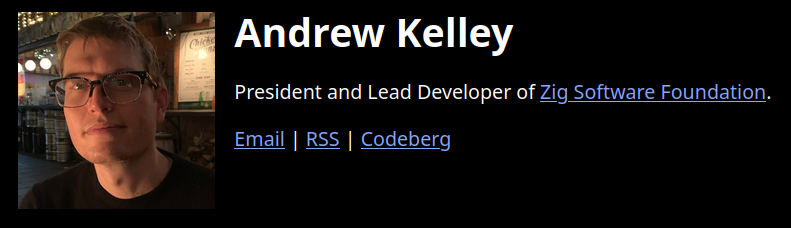
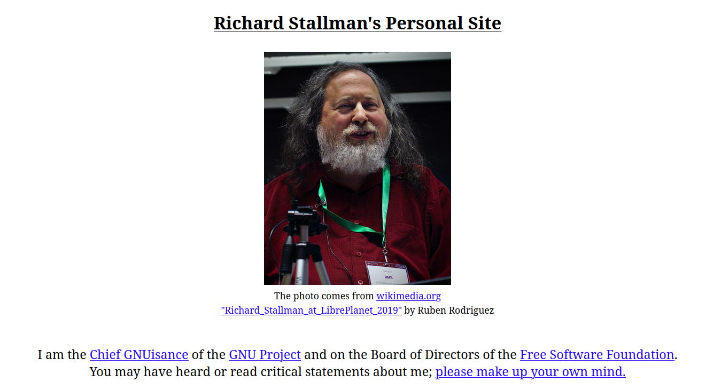
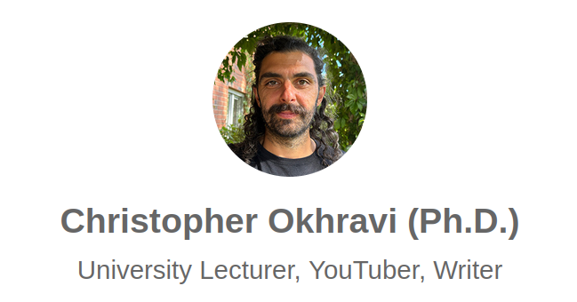

**Presentarme**.

Italo Visconti, Desarrollador de software con poco tiempo de graduado pero alrededor de 3 anios de experiencia en el desarrollo de software.

- Me gustan las computadoras.
- Resolver peos
- Hacerle la vida un poco mas facil a alguien (o a mi)
- Me gusta la computacion en la nube, de hecho me gustaria poder dar esa materia en un futuro

Hacer que los estudiantes se presenten con: **Nombre, por que les gusta programar, si actualmente trabajan**.

A mi lo que me gusta de programar es que solo necesitas esto :material-hand-back-right:, y para crear cosas maravillosas solo necesitas -> :material-hand-back-right:, y el unico limitante eres tu.
no necesitas grandes maquinas, materiales, permisos. Todo depende de ti, de que tanto te esfuerces, y de lo que te imagines.

Ademas, la informatica es un campo que recompensa la curiosidad y la creatividad.

**Rapido, diganme una idea que tengan**

Tantas cosas hechas por personas solas, o equipos pequenos, y ahora son mundialmente reconocidas.

Saben quien es el?  **FOTO DE: Linus Torvald**

> Lo que realmente disfruto de programar es que puedes decirle a la computadora exactamente qué hacer y lo hará al pie de la letra; eso no ocurre en la vida cotidiana.

Ese carajo empezo a hacer linux como un hobby

"just a hobby, won't be big and professional like gnu"

---
Hablar de:

**El uso de la IA y la importancia de siempre seguir aprendiendo**.

> "Los mejores ingenieros no son quienes programan más rapido, sino quienes piensan mas a fondo."

> "Las herramientas cambian, pero los principios perduran. Siempre enfócate en aprender a aprender."

---
*Y aqui podemos hilar lo de la IA:*

**De que te sientes orgulloso?**

**Ustedes se sienten motivados?** 

**Ustedes consideran a la IA una herramienta? O un reemplazo...** 

Nuestra carrera (y la carrera de muchos) esta cambiando, pero no es la primera vez que ocurre un cambio de esta manera, aunque yo si pienso que esto es diferente.

Para su fortuna esto es una herramienta, porque ustedes no son programadores, son ingenieros en informatica. Peguense eso en la cabeza.
Y esta es una herramienta que te hace 10 veces mas util

**Venezuela** esta atrasada en el tiempo, es como si nos hubieran congelado a todos y hay DEMASIADO por hacer.

**Ademas,** soft skills son importantes, aprender a expresar ideas, trabajar en equipo, comprender, apoyar... (y tambien el ingles).

---
**Esta charla** es interesante: [Should You Still Become a Software Engineer in 2026? GitHub VP](https://www.youtube.com/watch?v=W6aOdLlEz1w)
> El pánico tecnológico no es nuevo, las herramientas cambian pero el oficio queda

> El oficio no ha cambiado. La IA no genera arquitectura, todavía depende de nosotros pensar.

> Los fundamentos son irremplazables

Un punto que me gusto es que habla de hacer las cosas con proposito. el usa el ejemplo de I One Shotted a Minecraft Clone, no me importa, muestrame algo que de verdad sea util, que demuestra que estas haciendo algo con un proposito y que estas resolviendo algo. (Las apps para ver la tasa del dolar)

En la industria del software hay de todo, y cuando quieran leer opiniones de un loco, lean opiniones de un loco con trayectoria

Hay personas pragmaticas 

Hay personas demasiado pragmaticas

Hay otros poco pragmaticos

Hay muy buenos enseniando

---

Que tiene que ver todo esto que estoy diciendo con mi materia "**Topicos especiales de programacion**", es que esto no es una materia que lo ve cualquier persona, esto de hecho, es lo que hace complicada a esta materia, porque el software mal hecho y el software bien hecho, en el 90% de los casos es indiferente para el usuario, porque esos funciona y ya. 

Esa aplicacion del banco que tienes en el telefono esta bien hecha? no hablo de si se ve bonita, si es responsive, si los botones estan donde deben estar. hablo de si esta bien hecha tecnicamente... No lo sabes, porque eres un usuario. **Pero** si el dia de manana trabajas en mercantil como desarrollador y te toca tocar la app, capaz y vas a querer salir corriendo de ahi. Tienes que agregar un botón nuevo para pagar con biopago, cambias una línea de código... y de la nada se cae el módulo de transferencias a terceros. 

Cualquiera puede hacer un script en Python, cualquiera puede hacer un CRUD. Pero hacer software robusto, mantenible, desacoplado y que no explote cuando las cosas crezcan y tengas a 10 personas trabajando en eso, eso es **ingeniería de verdad**. Y eso te lo da la experiencia.

**La realidad es que en el desarrollo de software no existen leyes universales. Por eso aquí vemos principios, paradigmas y patrones, no REGLAS absolutas. (da rules) Las reglas no existen. Pero lo que NO es opcional es el criterio. Saber cuándo aplicar una solución, cuándo no complicarse la vida y entender por qué una decisión técnica funciona o fracasa: eso es justamente lo que los va a diferenciar del resto allá afuera.**

 «El que sabe, sabe» es el que no se casa ciegamente con ninguna tecnología ni con ninguna regla, sino que tiene el criterio de decir.

Y esto tambien aplica cuando usen IA. La IA es maravillosa, es como si tuvieras a un profesor al lado, 24/7 pero tengan cuidado.

---
**Cosas que me gustaria hacer en la clase:**

**Quisiera** traer a alguien para dar una charla sobre algun tema que les guste.

**Quisiera** que sean curiosos y que no le tengan miedo a preguntar cualquier cosa.

**Quisiera abrir las clases siempre con algo curioso que vea** en internet, o **hacer que las personas compartan algo** que hayan visto en la semana.

---
**Quien cree que esta materia es inutil?**

---
Dar **plan de evaluación**.

| Semana | Unidad Tematica / Evaluacion                                                                                                     | Bibliografía Sugerida                                                                                                   |
| -----: | -------------------------------------------------------------------------------------------------------------------------------- | ----------------------------------------------------------------------------------------------------------------------- |
|      1 | Prueba diagnóstica de OOP   Sistemas de tipos: nominales y estructurales   Tipos básicos                                   | [Riscutia, 2020] Capítulos 1 y 2   [Vanderkam, 2020] Capítulos 2, 3 y 4   [Freeman, 2021] Capítulos 8, 9, 10 y 11 |
|      2 | Composición y tipos de datos algebraicos                                                                                         | [Riscutia, 2020] Capítulo 3                                                                                             |
|      3 | Tipos funcionales. Subtyping (Subtipos)                                                                                          | [Riscutia, 2020] Capítulos 5 y 7                                                                                        |
|      4 | Aplicaciones avanzadas de los tipos funcionales:   - Funciones de orden superior   - Decoradores, Closures                 | [Riscutia, 2020] Capítulo 6   [Jansen, 2019] Capítulo 5                                                              |
|      5 | **Taller (15%)**                                                                                                                 | Evaluación de Tipos funcionales en TypeScript. Ejercicio para realizar durante las 3 horas en parejas.                  |
|      6 | Programación genérica: introducción a las estructuras de datos genéricas, map, filter, reduce                                    | [Riscutia, 2020] Capítulos 9 y 10                                                                                       |
|      7 | **Primer Examen Parcial (25%)**                                                                                                  | Evaluación de sistema de tipos estructurales, tipos funcionales y programación genérica                                 |
|      8 | Programación asíncrona: callbacks, Promesas y Async/Await                                                                        | [Riscutia, 2020] Capítulo 6   [Jansen, 2019] Capítulo 3                                                              |
|      9 | Mónadas (Monads) y Category Theory   Data Types: Optional, List, Either                                                       | [Riscutia, 2020] Capítulos 9 y 10   [Jansen, 2019] Capítulo 7                                                        |
|     10 | Programación orientada a aspectos / Aspect-oriented programming (AOP): uso de programación genérica y SOLID para implementar AOP | [Seemann, 2022] Capítulo 10                                                                                             |
|     11 | **Segundo Examen Parcial (25%)**                                                                                                 | Evaluación de Mónadas y programación asíncrona                                                                          |
|     12 | Programación reactiva / Functional Reactive Programming: introducción y bases teóricas                                           | [Jansen, 2019] Capítulo 9                                                                                               |
|     13 | Programación reactiva / Functional Reactive Programming: Observables                                                             | [Jansen, 2019] Capítulo 9                                                                                               |
|     14 | Programación reactiva / Functional Reactive Programming: Operators                                                               | [Jansen, 2019] Capítulo 9                                                                                               |
|     15 | **Entrega de Proyecto (25%)**                                                                                                    |                                                                                                                         |
|     16 | Entrega de Notas + Revisiones                                                                                                    | FIN DEL CURSO                                                                                                           |

**Quiero que despierten su creatividad**.
Donde buscar información, lugares recomendados:
- **Texto**:
	- FreeCodeCamp
	- Medium
	- Reddit (Subs de programacion)
	- ==Leer documentacion==

- **Videos**:
	- Computerphile en Youtube
	- Fireship en Youtube
	- ThePrimeagen en Youtube
	- Tsoding en Youtube/Twitch
	- ChristopherOkhravi en Youtube

