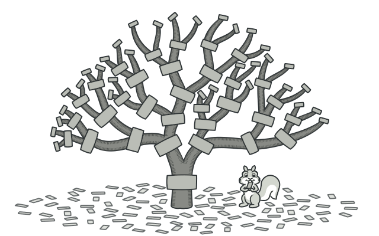
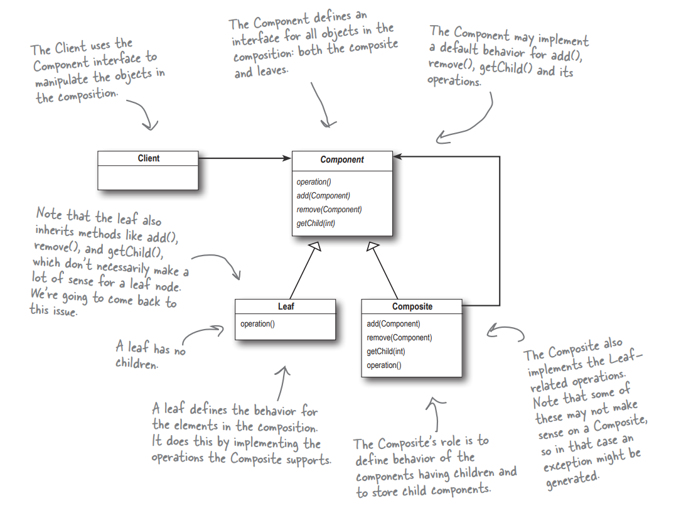
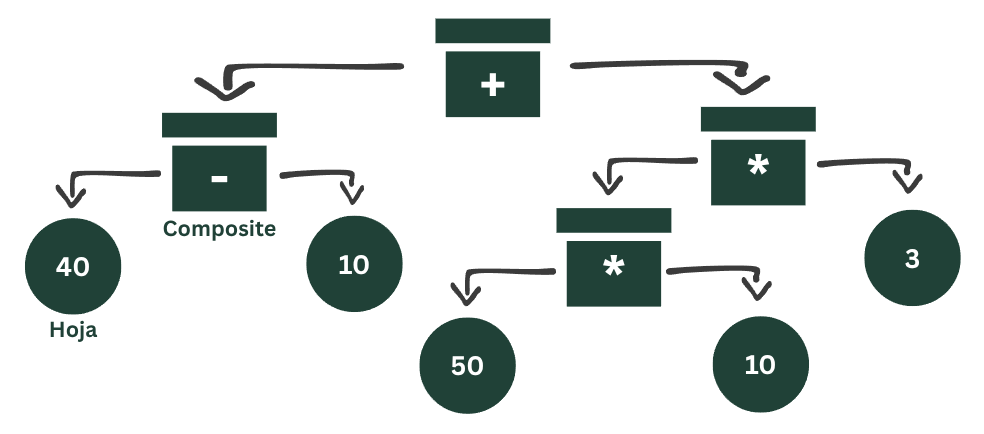
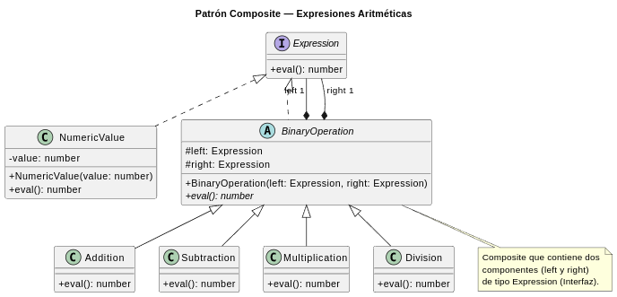
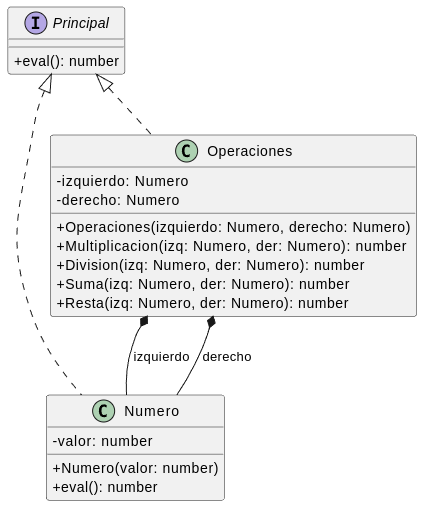
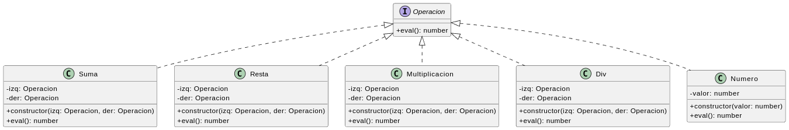

*Patrón de diseño estructural que te permite componer objetos en estructuras de árbol y trabajar con esas estructuras como si fueran objetos individuales.*


El Patrón Composite nos permite construir estructuras de objetos en forma de árbol que contienen tanto composiciones de objetos como objetos individuales a modo de nodos.
En otras palabras, en la mayoría de los casos podemos ignorar las diferencias entre las composiciones de objetos y los objetos individuales.

Nuevamente buscamos: **Abstracción**.



Un Composite contiene componentes. Los componentes vienen en dos tipos: composite y hojas. ¿Suena recursivo? **Lo es**.
Un Composite alberga un conjunto de hijos; esos hijos pueden ser otros composite u otras hojas.
Cuando organizas los datos de esta manera, terminas con una estructura de árbol con un composite en la raíz y ramas de composite que crecen hasta llegar a las hojas.

Entonces yo puedo aplicar las mismas operaciones sin necesidad de distinguir si estoy trabajando con un solo elemento o con una composición de elementos.

**Partiendo del ejercicio**:
Considere todas las posibles expresiones aritméticas posibles, por ejemplo:
```
(5 + 10 + (40 − 10) + (50 ∗ 10 ∗ 3) − (500/10))
```
Esto nos puede confundir, así que podríamos simplificarlo:
```
((40 − 10) + ((50 ∗ 10) ∗ 3))
```

Primero tenemos que visualizar el problema:


Diagrama de UML


#### Resolución
```ts
interface Expression {
  eval(): number;
}

// Hoja (Leaf)
class NumericValue implements Expression {
  private value: number;

  constructor(value: number) {
    this.value = value;
  }

  eval(): number {
    return this.value;
  }
}

// Composite para operaciones binarias
abstract class BinaryOperation implements Expression {
  protected left: Expression;
  protected right: Expression;

  constructor(left: Expression, right: Expression) {
    this.left = left;
    this.right = right;
  }

  abstract eval(): number;
}

// Implementaciones concretas de los composite
class Addition extends BinaryOperation {
  eval(): number {
    return this.left.eval() + this.right.eval();
  }
}

class Subtraction extends BinaryOperation {
  eval(): number {
    return this.left.eval() - this.right.eval();
  }
}

class Multiplication extends BinaryOperation {
  eval(): number {
    return this.left.eval() * this.right.eval();
  }
}

class Division extends BinaryOperation {
  eval(): number {
    const rightValue = this.right.eval();
    if (rightValue === 0) {
      throw new Error("Error: División por cero.");
    }
    return this.left.eval() / rightValue;
  }
}

// Armamos la expresión
const finalExpression = new Subtraction(
    new Addition(
        new Addition(
            new Addition(
                new NumericValue(5),
                new NumericValue(10)
            ),
            new Subtraction(
                new NumericValue(40),
                new NumericValue(10)
            )
        ),
        new Multiplication(
            new Multiplication(
                new NumericValue(50),
                new NumericValue(10)
            ),
            new NumericValue(3)
        )
    ),
    new Division(
        new NumericValue(500),
        new NumericValue(10)
    )
);

console.log(`(5 + 10 + (40 - 10) + (50 * 10 * 3) - (500 / 10))`);
console.log(`Resultado: ${finalExpression.eval()}`); //1495

/*
* El patron Composite nos permite tratar tanto a los objetos individuales
* (NumericValue) como a las composiciones de objetos (BinaryOperation y sus subclases)
* de manera uniforme a través de la interfaz `Expression`.
*/
```
#### Resoluciones "Erróneas"
---
1- 


1. **No se cumple el contrato de la interfaz:** La clase `Operaciones` implementa la interfaz `Principal`, pero **no define el método `eval()`**. Esto es una violación directa del contrato de la interfaz y el código no compilará si intentas tratar a una `Operaciones` como un `Principal`. El objetivo del patrón es tratar a todos los objetos (hojas y compuestos) de la misma manera a través de una interfaz común.
2. **El Compuesto (Composite) depende de la Hoja (Leaf):** La clase `Operaciones` (el compuesto) tiene referencias directas a la clase `Numero` (la hoja) en su constructor y propiedades (`izquierdo: Numero`, `derecho: Numero`). Un verdadero patrón Composite debe depender de la abstracción (`Principal`), no de una implementación concreta. Debería ser `izquierdo: Principal` y `derecho: Principal`.
3. **No se puede crear una estructura de árbol:** Debido al punto anterior, es imposible anidar operaciones. No puedes crear una expresión como `(5 * 3) + 2`. Para hacer eso, el operando izquierdo de la suma (`+`) tendría que ser una operación de multiplicación (`*`), no solo un `Numero`. El código actual solo permite operaciones de un nivel, como `5 * 3`.
4. **La clase `Operaciones` no es un verdadero compuesto:** Esta clase actúa más como una "calculadora" o una clase de utilidad que agrupa funciones. No representa una operación única en el árbol de expresión. Un diseño Composite correcto tendría clases separadas para cada operación (`Suma`, `Multiplicacion`, etc.) que implementen `Principal` y contengan referencias a sus operandos (de tipo `Principal`).

2-


La implementación es correcta y realmente cumple los requisitos del patron Composite

1. **Interfaz Común (`Operacion`):** Tanto los objetos simples (`Numero`, la hoja) como los objetos compuestos (`Suma`, `Resta`, etc.) implementan la misma interfaz.
2. **Composición Recursiva:** Los objetos compuestos (`Suma`, etc.) contienen referencias a otros objetos del tipo de la interfaz (`Operacion`), lo que permite construir el árbol de expresiones.
3. **Operación Uniforme:** Puedes llamar a `eval()` en cualquier objeto, ya sea un simple `Numero` o una compleja `Suma` anidada, y funcionará de la misma manera desde la perspectiva del cliente.

Aun así, tenemos ciertos detalles a tomar en cuenta:
- **Duplicación de código**: Los campos `izquierda` y `derecha` + constructor se repiten 4 veces
- **Violación del principio DRY** (Don't Repeat Yourself)
- **Más difícil de mantener**: Si quieres cambiar algo común a todas las operaciones binarias, tienes que tocarlo en 4 lugares
Pero:
- No todo tiene que ser perfecto desde el inicio
- El refactoring es parte del proceso
- Los patrones emergen naturalmente cuando identificas repetición

La recomendación en este caso es extraer la lógica común de las operaciones (las clases que son composiciones) a una clase abstracta que se encuentre entre la interfaz y estas composiciones.