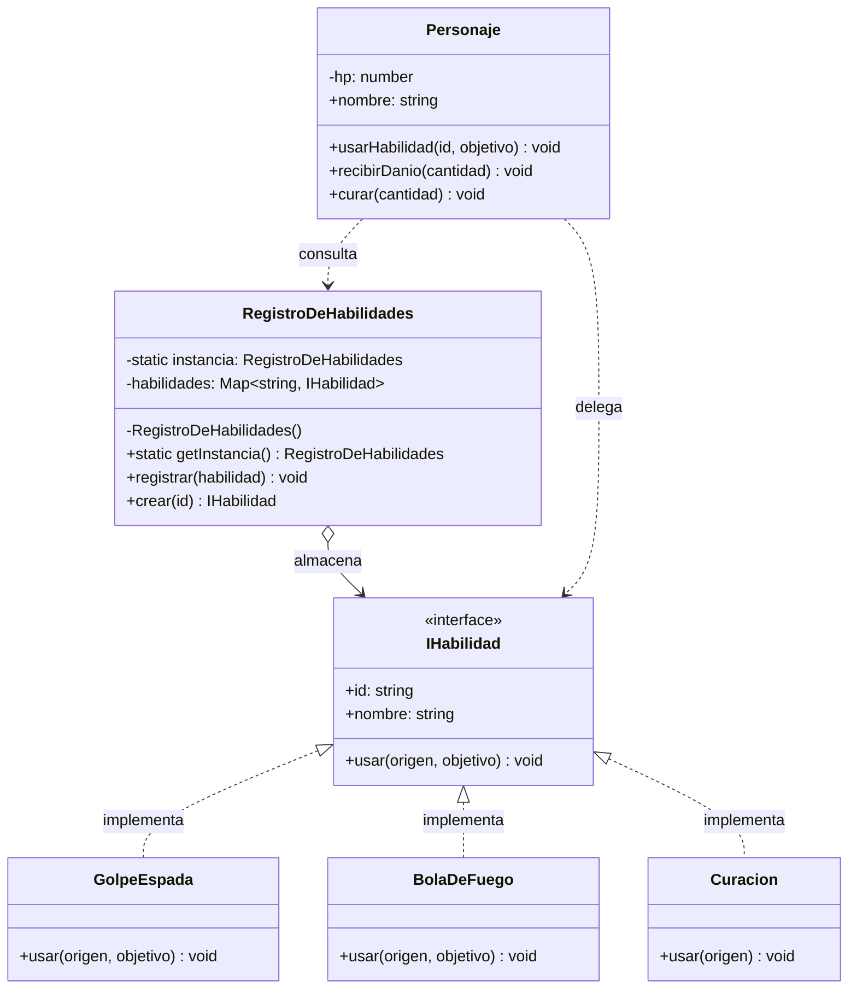

Estás en **UCABILIA**, un juego de rol por turnos. Cada personaje puede *usar habilidades*: un golpe de espada, una bola de fuego, una curación, etc. 

Lamentablemente, a día de hoy la clase `Personaje` decide la habilidad con un `switch`, y cada habilidad nueva obliga a modificar esa misma clase:

```ts
class Personaje {
  usarHabilidad(id: string, objetivo: Personaje): void {
    switch (id) {
      case "espada":
        objetivo.recibirDanio(10);
        break;
      case "fuego":
        objetivo.recibirDanio(25);
        break;
      case "curacion":
        this.curar(20);
        break;
      // ...cada habilidad nueva obliga a tocar ESTA clase
    }
  }
}
```

Al principio esto nos servía: el comportamiento de cada habilidad vivía dentro de `Personaje` y era fácil de leer. Pero el juego creció y ahora cada habilidad nueva —empuje, veneno, robo de vida, flecha de hielo…— nos obliga a volver a abrir `Personaje` y agregar otro `case`. Y lo que es peor: queremos que un enemigo pueda usar las mismas habilidades que el héroe, y que ciertos eventos del mapa desbloqueen habilidades nuevas **en caliente**, sin volver a compilar.

Nos dimos cuenta de que el problema no es *cuántas* habilidades existan, sino que `Personaje` sabe **demasiado**: no solo elige cuál usar, también conoce cómo funciona cada una. Cada requisito nuevo nos hace tocar la misma clase una y otra vez.

**Esto es lo que necesitamos:**

* Que el "cómo funciona" de cada habilidad viva **en su propio lugar**, aislado del resto. Agregar, quitar o reemplazar una habilidad no debería obligarnos a tocar a `Personaje` ni a las demás habilidades.
* Que un personaje pueda **usar cualquier habilidad sin conocer su implementación**: solo la pide por un identificador.
* Que exista **un único lugar en todo el juego** que sepa qué habilidades están disponibles, que las entregue y que las liste. Ese lugar debe ser el **mismo** para todos: dos catálogos desincronizados serían un dolor de cabeza.
* Que podamos **sumar habilidades nuevas en tiempo de ejecución** (por ejemplo, al desbloquearlas) sin modificar ni a `Personaje` ni a ese catálogo.

### Requisitos

1. Separa el comportamiento de cada habilidad de `Personaje`: cada habilidad debe ser una pieza independiente que sepa ejecutarse sobre un origen y un objetivo, y que se identifique con un `id` y un `nombre`.
2. Define un **contrato común** que todas las habilidades cumplan, de modo que `Personaje` pueda usar cualquiera sin conocer su tipo concreto.
3. Crea un **catálogo central** que conozca todas las habilidades disponibles, las entregue a partir de su `id`, permita listarlas, y garantice que haya **una sola instancia** en todo el programa con un punto de acceso claro a ella.
4. `Personaje` no debe contener ningún `switch`/`if` sobre habilidades concretas: solo debe pedirle la habilidad al catálogo y **delegar** el trabajo.
5. Diseña el sistema para poder **registrar una habilidad nueva en tiempo de ejecución**, sin modificar `Personaje` ni el catálogo.
6. Demuestra que dos pedidos del catálogo obtienen **la misma instancia** (no se crean copias).

> [!NOTE] Tu solución no tiene que ser idéntica a la propuesta
> En la resolución se muestra *una* forma de lograrlo. Lo importante es que cumplas los requisitos y puedas justificar cada decisión.

### Preguntas de reflexión

1. ¿Qué patrones de diseño, de los vistos en clase, aparecen (o podrían aparecer) en tu solución? Justifica qué rol cumple cada uno.
2. Un `Map` global `const habilidades = new Map(...)` también guardaría las habilidades. ¿Por qué no es suficiente? ¿Qué te da el hecho de que exista una sola instancia del catálogo?
3. ¿Qué problemas concretos aparecerían si existieran **dos** catálogos vivos al mismo tiempo? Relaciónalo con la analogía de la *torre de control*.
4. ¿Este catálogo es una decisión de diseño legítima o un *Service Locator* disfrazado? ¿En qué momento se vuelve un antipatrón?
5. En este ejemplo las habilidades no tienen estado. ¿Conviene reutilizar las mismas instancias o crear una nueva en cada uso? ¿Y si una habilidad guardara estado por uso?
6. ¿Cómo agregarías una habilidad nueva sin tocar `Personaje` ni el catálogo? ¿Qué **principio SOLID** se está cumpliendo?
7. Compara este diseño con el de *UrbanRide* (guía práctica): ¿en qué se parece y en qué se diferencia la forma de elegir el comportamiento?

---

## Resolución

### 1. El diseño, en una frase

`Personaje` es el **contexto** de Strategy: no implementa ningún ataque, solo **delega** en un objeto `IHabilidad`. La pregunta "¿de dónde sale esa habilidad?" la responde el **registro**, que resuelve dos cosas a la vez: **crea/selecciona** estrategias (Factory) y garantiza que exista **una sola fuente de verdad** de qué habilidades hay (Singleton).

### 2. Diagrama de clases (propuesta)



### 3. Implementación completa

```ts
// ─────────────────────────────────────────────────────────
// 1. STRATEGY: el contrato común de las habilidades
// ─────────────────────────────────────────────────────────
interface IHabilidad {
  readonly id: string;
  readonly nombre: string;
  usar(origen: Personaje, objetivo: Personaje): void;
}

// 2. Estrategias concretas (una "caja" por algoritmo)
class GolpeEspada implements IHabilidad {
  readonly id = "espada";
  readonly nombre = "Golpe de Espada";

  usar(origen: Personaje, objetivo: Personaje): void {
    objetivo.recibirDanio(10);
    console.log(`${origen.nombre} usa ${this.nombre} → ${objetivo.nombre} pierde 10 HP`);
  }
}

class BolaDeFuego implements IHabilidad {
  readonly id = "fuego";
  readonly nombre = "Bola de Fuego";

  usar(origen: Personaje, objetivo: Personaje): void {
    objetivo.recibirDanio(25);
    console.log(`${origen.nombre} lanza ${this.nombre} → ${objetivo.nombre} pierde 25 HP`);
  }
}

class Curacion implements IHabilidad {
  readonly id = "curacion";
  readonly nombre = "Curación";

  // Cumple el contrato con menos parámetros: solo se cura a sí misma.
  usar(origen: Personaje): void {
    origen.curar(20);
    console.log(`${origen.nombre} usa ${this.nombre} → recupera 20 HP`);
  }
}

// ─────────────────────────────────────────────────────────
// 3. SINGLETON + FACTORY: el catálogo de estrategias
// ─────────────────────────────────────────────────────────
class RegistroDeHabilidades {
  private static instancia: RegistroDeHabilidades | null = null;
  private readonly habilidades = new Map<string, IHabilidad>();

  // Constructor privado: nadie crea el catálogo desde afuera.
  // Aquí se registra la configuración por defecto, una sola vez.
  private constructor() {
    this.registrar(new GolpeEspada());
    this.registrar(new BolaDeFuego());
    this.registrar(new Curacion());
  }

  // Punto de acceso global a la única instancia (inicialización perezosa).
  static getInstancia(): RegistroDeHabilidades {
    if (!RegistroDeHabilidades.instancia) {
      RegistroDeHabilidades.instancia = new RegistroDeHabilidades();
    }
    return RegistroDeHabilidades.instancia;
  }

  // Factory: dar de alta una estrategia.
  registrar(habilidad: IHabilidad): void {
    this.habilidades.set(habilidad.id, habilidad);
  }

  // Factory: entregar la estrategia pedida.
  crear(id: string): IHabilidad {
    const habilidad = this.habilidades.get(id);
    if (!habilidad) {
      throw new Error(`Habilidad desconocida: ${id}`);
    }
    return habilidad;
  }

  ids(): string[] {
    return [...this.habilidades.keys()];
  }
}

// ─────────────────────────────────────────────────────────
// 4. CONTEXTO: delega en una estrategia obtenida del registro
// ─────────────────────────────────────────────────────────
class Personaje {
  private hp: number;

  constructor(public readonly nombre: string, hp = 100) {
    this.hp = hp;
  }

  usarHabilidad(id: string, objetivo: Personaje): void {
    // No hay switch: el "cómo" vive en la estrategia.
    const habilidad = RegistroDeHabilidades.getInstancia().crear(id);
    habilidad.usar(this, objetivo);
  }

  recibirDanio(cantidad: number): void {
    this.hp = Math.max(0, this.hp - cantidad);
  }

  curar(cantidad: number): void {
    this.hp += cantidad;
  }

  get estado(): string {
    return `${this.nombre} — ${this.hp} HP`;
  }
}

// ─────────────────────────────────────────────────────────
// 5. Uso
// ─────────────────────────────────────────────────────────
const heroe = new Personaje("Aria", 80);
const enemigo = new Personaje("Gólem", 120);

console.log("Habilidades registradas:", RegistroDeHabilidades.getInstancia().ids().join(", "));

heroe.usarHabilidad("espada", enemigo);
enemigo.usarHabilidad("fuego", heroe);
heroe.usarHabilidad("curacion", heroe);

console.log(heroe.estado);
console.log(enemigo.estado);

// ─────────────────────────────────────────────────────────
// 6. Extensión en runtime: nueva estrategia sin tocar
//    Personaje ni RegistroDeHabilidades
// ─────────────────────────────────────────────────────────
class FlechaDeHielo implements IHabilidad {
  readonly id = "hielo";
  readonly nombre = "Flecha de Hielo";

  usar(origen: Personaje, objetivo: Personaje): void {
    objetivo.recibirDanio(18);
    console.log(`${origen.nombre} dispara ${this.nombre} → ${objetivo.nombre} pierde 18 HP`);
  }
}

RegistroDeHabilidades.getInstancia().registrar(new FlechaDeHielo());
heroe.usarHabilidad("hielo", enemigo);

const a = RegistroDeHabilidades.getInstancia();
const b = RegistroDeHabilidades.getInstancia();
console.log("¿Misma instancia?", a === b);
```

### 4. Salida esperada

```text
Habilidades registradas: espada, fuego, curacion
Aria usa Golpe de Espada → Gólem pierde 10 HP
Gólem lanza Bola de Fuego → Aria pierde 25 HP
Aria usa Curación → recupera 20 HP
Aria — 75 HP
Gólem — 110 HP
Aria dispara Flecha de Hielo → Gólem pierde 18 HP
¿Misma instancia? true
```

### 5. Respuestas a las preguntas de reflexión

**1. El rol de cada patrón.**

- **Strategy:** `IHabilidad` es el contrato de la *familia de algoritmos* y `GolpeEspada`, `BolaDeFuego`, `Curacion`, etc. son los algoritmos concretos. `Personaje` es el *contexto* que delega `usar()` sin conocer la implementación.
- **Factory:** `RegistroDeHabilidades.crear(id)` encapsula la creación/selección. `Personaje` no hace `new GolpeEspada()`; solo pide "la habilidad llamada `espada`".
- **Singleton:** el registro debe ser único, porque es la fuente de verdad de qué habilidades existen. `getInstancia()` y el constructor privado garantizan una sola instancia y un punto de acceso global.

**2. ¿Por qué un `Map` global no alcanza?**

Un `Map` global se puede **reasignar o pisar** desde cualquier parte, y su inicialización queda dispersa: dos módulos podrían crear el suyo y quedar desincronizados. El Singleton encapsula el estado, **controla la creación** (constructor privado) y **centraliza la configuración inicial** (el registro por defecto ocurre una sola vez). La diferencia no es "global vs. no global", es *quién controla el ciclo de vida*.

**3. ¿Y si hubiera dos registros?**

El argumento es el mismo que el de la torre de control: dos torres dan órdenes contradictorias. Aquí, un personaje podría pedir una habilidad que está registrada en el *otro* catálogo y no encontrarla, o alguien registraría `hielo` en un registro mientras el resto del juego consulta el otro. El estado compartido se **divide** y aparecen comportamientos inconsistentes difíciles de rastrear.

**4. ¿Singleton legítimo o Service Locator?**

Es un Singleton **legítimo** mientras sea la única fuente de verdad de un recurso compartido y no se use como "cajón de sastre" para resolver dependencias arbitrarias. Se degrada a **Service Locator** (antipatrón) cuando el contexto lo usa para **esconder sus dependencias**: `Personaje` ya no declara qué necesita, la va a buscar al registro. La versión más limpia y testeable es **inyectar** el registro (o la estrategia) por constructor y dejar el Singleton solo como punto de acceso *por defecto*:

```ts
class Personaje {
  constructor(
    public readonly nombre: string,
    private readonly registro: RegistroDeHabilidades = RegistroDeHabilidades.getInstancia()
  ) {}
  // ...
}
```

La discusión de fondo: *¿cuándo el acceso global simplifica y cuándo acopla y complica los tests?* No hay una respuesta única.

**5. ¿Reutilizar instancias o crear una nueva?**

Como las estrategias **no tienen estado**, conviene **reutilizarlas**: el registro las guarda una sola vez y entrega la misma instancia (menos `new`, menos memoria, identidad estable). Es el espíritu del patrón *Flyweight*. Si una estrategia guardara **estado por uso** (por ejemplo, un contador de cargas), compartir la instancia mezclaría el estado de distintos personajes; ahí habría que crear una instancia nueva por uso, clonarla o inyectar el estado desde afuera. Regla práctica: **estrategias sin estado → compartir; con estado → una por uso.**

**6. ¿Agregar una habilidad sin tocar nada?**

```ts
RegistroDeHabilidades.getInstancia().registrar(new FlechaDeHielo());
```

Se cumple el **Principio Abierto/Cerrado (OCP)**: el sistema se **extiende** agregando código nuevo (una estrategia nueva) sin **modificar** el existente. `Personaje` y `RegistroDeHabilidades` no cambian. *(Detalle: si quisiéramos que esa habilidad venga de fábrica, sí tocaríamos el constructor privado, pero el resto del sistema sigue intacto; y siempre está la alternativa de registrar por fuera del constructor.)*

**7. Comparación con *UrbanRide*.**

La parte de Strategy es idéntica en espíritu: una interfaz (`TarifaBase` / `IHabilidad`), varias implementaciones concretas, y un contexto que **delega** (`calcular()` / `usar()`). Lo que cambia es **quién elige**: en *UrbanRide* la `FabricaTarifa` usa un `if/else` sobre la distancia; aquí el registro usa un `Map` **por nombre**. Esa diferencia importa: agregar una estrategia nueva al `if/else` implica **editar una cadena de condiciones**; agregar una al `Map` es un **`set`**, sin ramas nuevas. Además, en *UrbanRide* la fábrica es una clase con método estático; aquí la fábrica **es** el mismo objeto compartido (Singleton), no una utilidad aparte.

> [!TIP] Regla de oro
> **Strategy** responde *“cómo se hace”*. La **Factory** responde *“quién crea/elige la estrategia”*. El **Singleton** responde *“cuántas copias de esa decisión existen”*. Cuando los tres roles están claros, el contexto queda reducido a delegar.

> [!WARNING] No abuses del Singleton
> El Singleton es cómodo, pero introduce **estado global** y hace más difíciles los tests y el paralelismo. Úsalo cuando de verdad exista un recurso compartido único (una configuración, un catálogo, una conexión). Si lo usás solo para no pasar dependencias, probablemente quieras inyección de dependencias en lugar de un Singleton.
