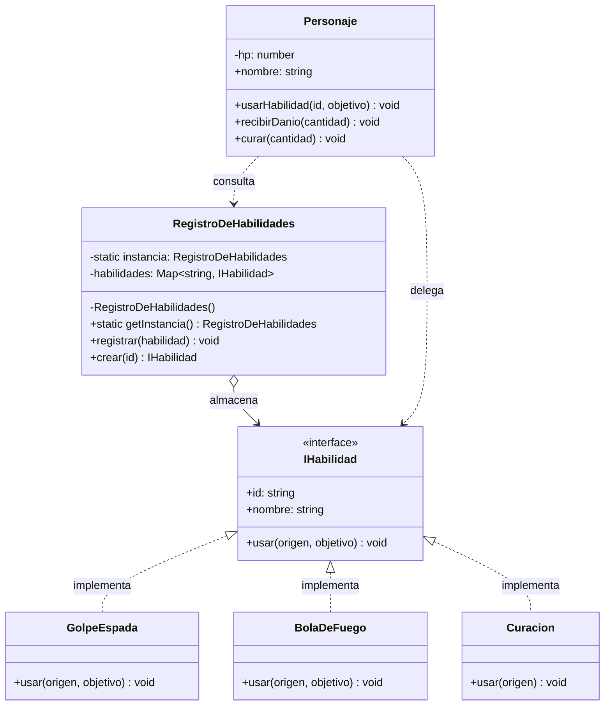

# Resolución — Catálogo de Habilidades

*Solución propuesta para el [Ejercicio — Catálogo de Habilidades](Ejercicio%20-%20Cat%C3%A1logo%20de%20Habilidades.md).*

## 1. El diseño

`Personaje` es el **contexto** de Strategy: no implementa ningún ataque, solo **delega** en un objeto `IHabilidad`. La pregunta "¿de dónde sale esa habilidad?" la responde el **registro**, que resuelve dos cosas a la vez: **crea/selecciona** estrategias (Factory) y garantiza que exista **una sola fuente de verdad** de qué habilidades hay (Singleton).

## 2. Diagrama de clases (propuesta)



## 3. Implementación completa

```ts
// ─────────────────────────────────────────────────────────
// 1. STRATEGY: el contrato común de las habilidades
// ─────────────────────────────────────────────────────────
interface IHabilidad {
  readonly id: string;
  readonly nombre: string;
  usar(origen: Personaje, objetivo: Personaje): void;
}

// 2. Estrategias concretas (una "caja" por algoritmo)
class GolpeEspada implements IHabilidad {
  readonly id = "espada";
  readonly nombre = "Golpe de Espada";

  usar(origen: Personaje, objetivo: Personaje): void {
    objetivo.recibirDanio(10);
    console.log(`${origen.nombre} usa ${this.nombre} → ${objetivo.nombre} pierde 10 HP`);
  }
}

class BolaDeFuego implements IHabilidad {
  readonly id = "fuego";
  readonly nombre = "Bola de Fuego";

  usar(origen: Personaje, objetivo: Personaje): void {
    objetivo.recibirDanio(25);
    console.log(`${origen.nombre} lanza ${this.nombre} → ${objetivo.nombre} pierde 25 HP`);
  }
}

class Curacion implements IHabilidad {
  readonly id = "curacion";
  readonly nombre = "Curación";

  // Cumple el contrato con menos parámetros: solo se cura a sí misma.
  usar(origen: Personaje): void {
    origen.curar(20);
    console.log(`${origen.nombre} usa ${this.nombre} → recupera 20 HP`);
  }
}

// ─────────────────────────────────────────────────────────
// 3. SINGLETON + FACTORY: el catálogo de estrategias
// ─────────────────────────────────────────────────────────
class RegistroDeHabilidades {
  private static instancia: RegistroDeHabilidades | null = null;
  private readonly habilidades = new Map<string, IHabilidad>();

  // Constructor privado: nadie crea el catálogo desde afuera.
  // Aquí se registra la configuración por defecto, una sola vez.
  private constructor() {
    this.registrar(new GolpeEspada());
    this.registrar(new BolaDeFuego());
    this.registrar(new Curacion());
  }

  // Punto de acceso global a la única instancia (inicialización perezosa).
  static getInstancia(): RegistroDeHabilidades {
    if (!RegistroDeHabilidades.instancia) {
      RegistroDeHabilidades.instancia = new RegistroDeHabilidades();
    }
    return RegistroDeHabilidades.instancia;
  }

  // Factory: dar de alta una estrategia.
  registrar(habilidad: IHabilidad): void {
    this.habilidades.set(habilidad.id, habilidad);
  }

  // Factory: entregar la estrategia pedida.
  crear(id: string): IHabilidad {
    const habilidad = this.habilidades.get(id);
    if (!habilidad) {
      throw new Error(`Habilidad desconocida: ${id}`);
    }
    return habilidad;
  }

  ids(): string[] {
    return [...this.habilidades.keys()];
  }
}

// ─────────────────────────────────────────────────────────
// 4. CONTEXTO: delega en una estrategia obtenida del registro
// ─────────────────────────────────────────────────────────
class Personaje {
  private hp: number;

  constructor(public readonly nombre: string, hp = 100) {
    this.hp = hp;
  }

  usarHabilidad(id: string, objetivo: Personaje): void {
    // No hay switch: el "cómo" vive en la estrategia.
    const habilidad = RegistroDeHabilidades.getInstancia().crear(id);
    habilidad.usar(this, objetivo);
  }

  recibirDanio(cantidad: number): void {
    this.hp = Math.max(0, this.hp - cantidad);
  }

  curar(cantidad: number): void {
    this.hp += cantidad;
  }

  get estado(): string {
    return `${this.nombre} — ${this.hp} HP`;
  }
}

// ─────────────────────────────────────────────────────────
// 5. Uso
// ─────────────────────────────────────────────────────────
const heroe = new Personaje("Aria", 80);
const enemigo = new Personaje("Gólem", 120);

console.log("Habilidades registradas:", RegistroDeHabilidades.getInstancia().ids().join(", "));

heroe.usarHabilidad("espada", enemigo);
enemigo.usarHabilidad("fuego", heroe);
heroe.usarHabilidad("curacion", heroe);

console.log(heroe.estado);
console.log(enemigo.estado);

// ─────────────────────────────────────────────────────────
// 6. Extensión en runtime: nueva estrategia sin tocar
//    Personaje ni RegistroDeHabilidades
// ─────────────────────────────────────────────────────────
class FlechaDeHielo implements IHabilidad {
  readonly id = "hielo";
  readonly nombre = "Flecha de Hielo";

  usar(origen: Personaje, objetivo: Personaje): void {
    objetivo.recibirDanio(18);
    console.log(`${origen.nombre} dispara ${this.nombre} → ${objetivo.nombre} pierde 18 HP`);
  }
}

RegistroDeHabilidades.getInstancia().registrar(new FlechaDeHielo());
heroe.usarHabilidad("hielo", enemigo);

const a = RegistroDeHabilidades.getInstancia();
const b = RegistroDeHabilidades.getInstancia();
console.log("¿Misma instancia?", a === b);
```

## 4. Salida esperada

```text
Habilidades registradas: espada, fuego, curacion
Aria usa Golpe de Espada → Gólem pierde 10 HP
Gólem lanza Bola de Fuego → Aria pierde 25 HP
Aria usa Curación → recupera 20 HP
Aria — 75 HP
Gólem — 110 HP
Aria dispara Flecha de Hielo → Gólem pierde 18 HP
¿Misma instancia? true
```

## 5. Respuestas a las preguntas de reflexión

**1. ¿Por qué un `Map` global no alcanza?**

Un `Map` global se puede **reasignar o pisar** desde cualquier parte, y su inicialización queda dispersa: dos módulos podrían crear el suyo y quedar desincronizados. El Singleton encapsula el estado, **controla la creación** (constructor privado) y **centraliza la configuración inicial** (el registro por defecto ocurre una sola vez). La diferencia no es "global vs. no global", es *quién controla el ciclo de vida*.

**2. ¿Y si hubiera dos registros?**

El argumento es el mismo que el de la torre de control: dos torres dan órdenes contradictorias. Aquí, un personaje podría pedir una habilidad que está registrada en el *otro* catálogo y no encontrarla, o alguien registraría `hielo` en un registro mientras el resto del juego consulta el otro. El estado compartido se **divide** y aparecen comportamientos inconsistentes difíciles de rastrear.

**3. ¿Reutilizar instancias o crear una nueva?**

Como las estrategias **no tienen estado**, conviene **reutilizarlas**: el registro las guarda una sola vez y entrega la misma instancia (menos `new`, menos memoria, identidad estable). Es el espíritu del patrón *Flyweight*. Si una estrategia guardara **estado por uso** (por ejemplo, un contador de cargas), compartir la instancia mezclaría el estado de distintos personajes; ahí habría que crear una instancia nueva por uso, clonarla o inyectar el estado desde afuera. Regla práctica: **estrategias sin estado → compartir; con estado → una por uso.**

**4. ¿Agregar una habilidad sin tocar nada?**

```ts
RegistroDeHabilidades.getInstancia().registrar(new FlechaDeHielo());
```

Se cumple el **Principio Abierto/Cerrado (OCP)**: el sistema se **extiende** agregando código nuevo (una estrategia nueva) sin **modificar** el existente. `Personaje` y `RegistroDeHabilidades` no cambian. *(Detalle: si quisiéramos que esa habilidad venga de fábrica, sí tocaríamos el constructor privado, pero el resto del sistema sigue intacto; y siempre está la alternativa de registrar por fuera del constructor.)*

> [!TIP] Regla de oro
> **Strategy** responde *“cómo se hace”*. La **Factory** responde *“quién crea/elige la estrategia”*. El **Singleton** responde *“cuántas copias de esa decisión existen”*. Cuando los tres roles están claros, el contexto queda reducido a delegar.

> [!WARNING] No abuses del Singleton
> El Singleton es cómodo, pero introduce **estado global** y hace más difíciles los tests y el paralelismo. Úsalo cuando de verdad exista un recurso compartido único (una configuración, un catálogo, una conexión). Si lo usas solo para no pasar dependencias, probablemente quieras inyección de dependencias en lugar de un Singleton.
