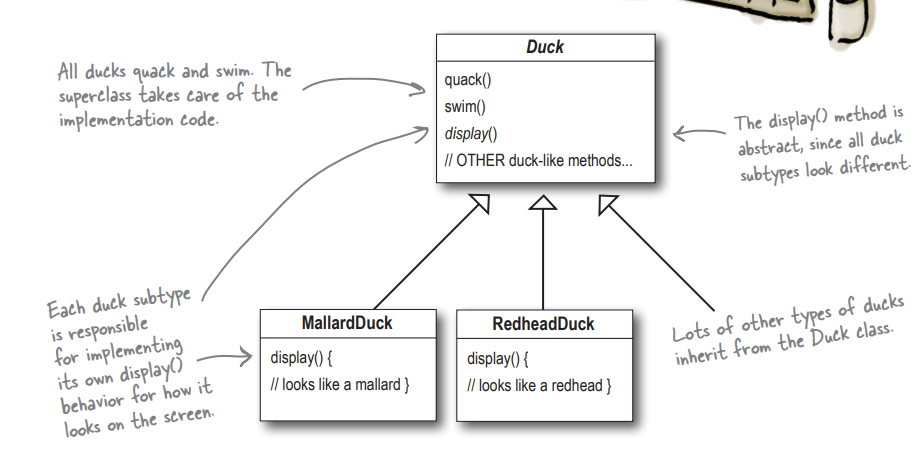
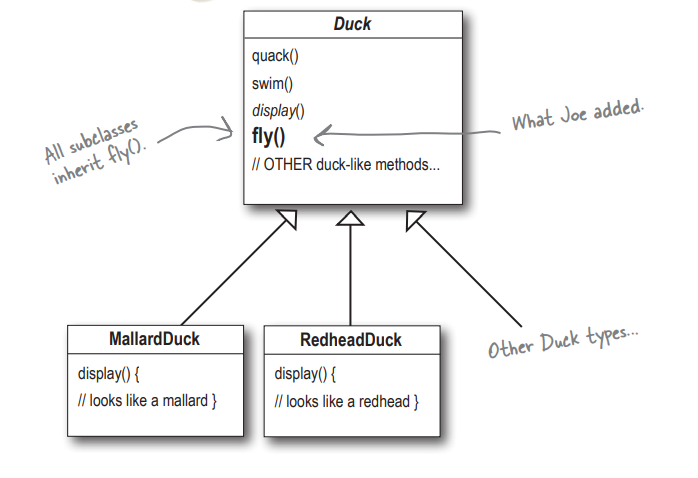
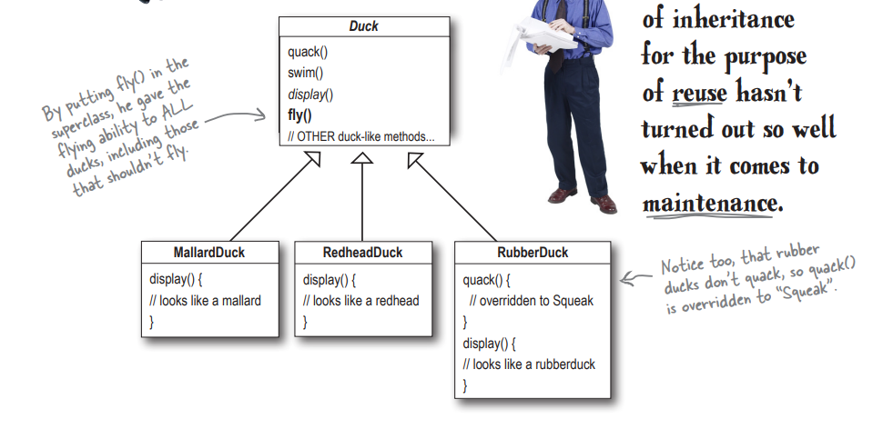
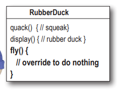
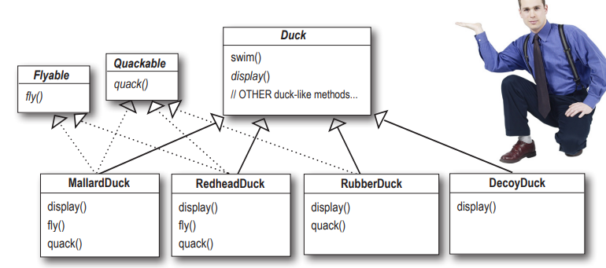
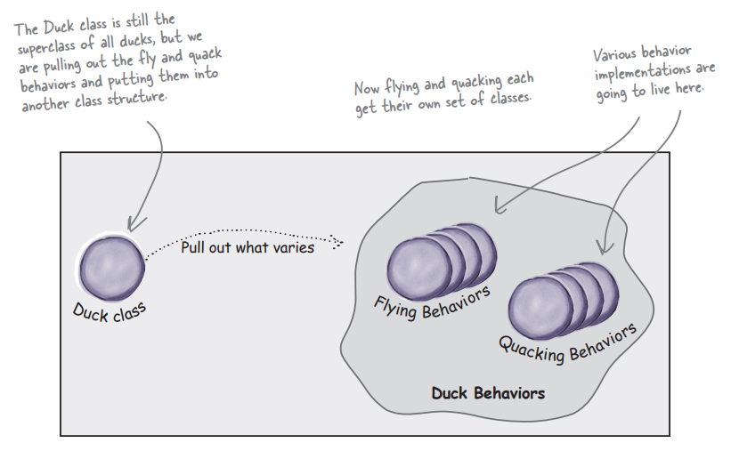
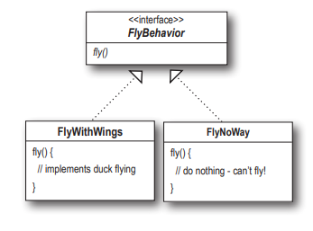
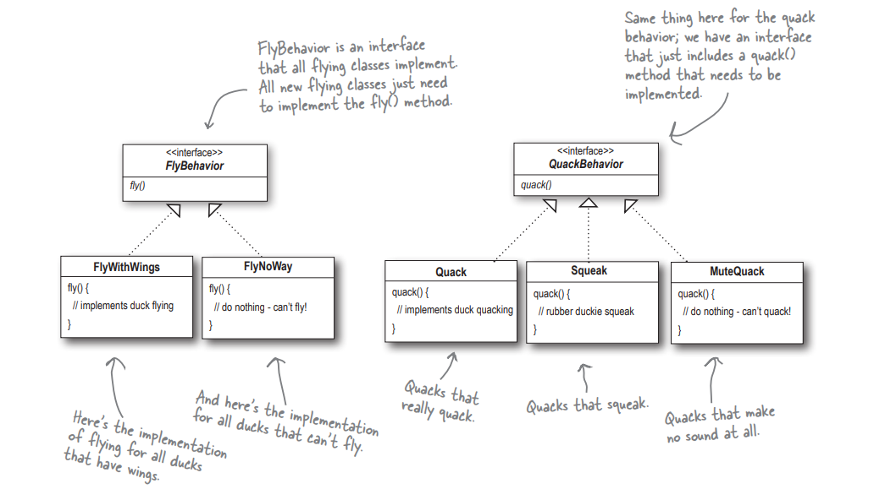
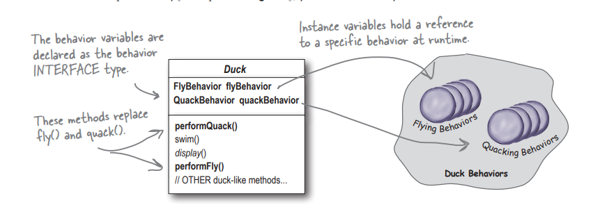

*Patrón de diseño de comportamiento que te permite definir una familia de algoritmos, colocar cada uno de ellos en una clase separada y hacer sus objetos intercambiables. Strategy deja que sus algoritmos varíen independientemente de los clientes que los usen*
Abordaremos el Patron Strategy de una manera un tanto distinta.

Estamos trabajando en un **juego** de simulación sobre Patos, en el juego hay una gran variedad de especies, y cada una de ellos pueden pueden **nadar** y hacer **quack**.

Que sencillo! Nuestro planteamiento inicial es el siguiente:

El juego ha ganado popularidad y ahora necesitamos **innovar**, por eso necesitamos algo nuevo...
**Necesitamos que los patos vuelen**.
Pero parece que hoy es nuestro ==día de suerte==, porque esto es tan sencillo como agregar un **método fly() al padre** y que **todos las subclases lo hereden**. 

Pero cuando probamos el juego empezamos a notar cosas un poco... **raras**.
Creíamos que nuestro planteamiento con la herencia era excelente gracias a la **reutilización**, pero esto ha generado un problema en lo que respecta al **mantenimiento**.

Ademas debemos sobrescribir el comportamiento de volar, porque los patos de goma tampoco vuelan.

Y esto puede ocurrir con muchos mas ejemplos, podemos usar incluso el DecoyDuck, (o pato de mentira/señuelo), el cual tampoco hace quack, ni tampoco vuela.

De esta manera nos damos cuenta que **la herencia no siempre es la solución**, y menos cuando los comportamientos son propensos a cambiar. Si siguen añadiendo nuevos tipos de pato, debemos modificar la implementacion de esta nueva subclase. y pero aun, si agregan un nuevo comportamiento a la clase padre (por ejemplo, ahora queremos que los patos caminen), **debemos modificar todas y cada una de las subclases**.

Ya sabemos la raíz del problema, es decir, sabemos que cambia, así que:

Podría sacar `fly()` de la superclase Pato y crear una interfaz `Flyable` con un método `fly()`. De esa manera, solo los patos que se supone que vuelan implementarían esa interfaz y tendrían un método `fly()`... y, ya que estoy, también podría hacer un `Quackable`, ya que no todos los patos pueden hacer quack.

> [!NOTE] Recuerda que
> Una subclase puede heredar/extender de una clase padre, pero a su vez puede implementar una o mas interfaces. En TypeScript se ve como: 
> `class MallardDuck extends Duck implements Flyable, Quackable {`

Para solucionar esto, se propone usar **interfaces** (`Flyable` y `Quackable`). De esta manera, solo las clases que necesitan esos comportamientos los implementan. El problema es que esta solución tampoco es perfecta: si varios tipos de patos vuelan de la misma manera, tendrías que **duplicar el código** del método `fly()` en cada una de sus clases, lo que es lo opuesto a la reutilización y crea una "pesadilla de mantenimiento".

**Están viendo las vueltas que estamos dando gracias a los cambios que ocurren en los requerimientos?**

Esta solución es algo mejor a lo que teníamos inicialmente, pero seguimos teniendo problemas, y cuando existan cambios en los requerimientos estamos obligados a cambiar mucho código, y hay algo que debemos saber: **Mientras mayor cantidad de código sea propenso a cambiar, mas errores se pueden generar**.

> [!TIP] Principio de Diseño
> Identifica los aspectos de tu aplicación que varían y sepáralos de lo que se mantiene igual.

En otras palabras, toma las partes que varían y **encapsúlalas**, para que luego puedas modificarlas o extenderlas sin afectar aquellas que no cambian. Tan simple como es, este concepto forma la base de casi todos los patrones de diseño. Todos los patrones permiten que una parte de un sistema cambie de forma independiente a todas las demás partes.

#### Separar las partes que cambian de las que se mantienen igual.
Sabemos que `fly()` y `quack()` son las partes de la clase `Pato` que varían entre los distintos patos. Para separar estos comportamientos de la clase `Pato`, extraeremos ambos métodos de la clase y crearemos un nuevo conjunto de clases para representar cada comportamiento.

A partir de ahora, las **acciones** de los Patos (como fly o quack) se pondrán en "cajas" de código separadas.
De esta manera, la clase padre `Duck` ya **no necesita saber cómo funciona cada acción por dentro**. Simplemente elige la "caja" que necesita usar y listo. Siempre y cuando el comportamiento cumpla con el contrato que se define (La Interfaz), la clase pato podrá hacer uso de él sin problema.

Ahora nuestros comportamientos se ven algo así:

Con nuestro nuevo diseño, las subclases de `Duck` usarán un comportamiento representado por una **interfaz** (`FlyBehavior` y `QuackBehavior`), de modo que la implementación real del comportamiento (el comportamiento concreto) no quedará ligada a las subclases de `Duck`.

Con este diseño, otros tipos de objetos pueden reutilizar nuestros comportamientos de `fly` y `quack` porque estos ya no están ocultos dentro de nuestras clases `Duck`. Y podemos añadir nuevos comportamientos sin modificar ninguna de nuestros comportamiento existentes ni tocar ninguna de las clases `Duck` que los utilizan.
#### Integrar los comportamientos de `Duck`
La **clave** de esto es que un `Duck` ahora transferirá la responsabilidad de sus comportamientos de vuelo y graznido (es decir, los delega), en lugar de usar/ejecutar los métodos definidos dentro de su misma clase (o clase padre)

Primero, **añadimos dos variables** tipo `FlyBehavior` y `QuackBehavior` (recordemos que estas dos son interfaces). Cada `Duck` concreto asignará a estas variables un comportamiento específico en tiempo de ejecución, como `FlyWithWings` para volar y `Squeak` para graznar.

También **eliminamos los métodos** `fly()` y `quack()` de la clase `Duck` (y de cualquier subclase) porque hemos trasladado este comportamiento a las clases `FlyBehavior` y `QuackBehavior`.

**Reemplazamos** `fly()` y `quack()` en la clase `Duck` con dos métodos similares, llamados `performFly()` y `performQuack()`.

Por ultimo, **añadimos** dos nuevos métodos, los cuales serán **Setters**, que permiten cambiar los comportamientos de `fly` y `quack` en tiempo de ejecucion. `setFlyBehavior()` y `setQuackBehavior()`

Por ultimo tenemos algo como:

Hemos empezado a describir las cosas de manera **un poco diferente**. En lugar de pensar en los comportamientos del `Duck` como un conjunto de comportamientos, empezaremos a verlos como una **familia de algoritmos**. Piénsalo: en el diseño del juego, los algoritmos representan cosas que haría un pato (distintas formas de `fly` o  `quack`).

Y podemos usar estas mismas técnicas para muchos otros casos. por **ejemplo**, *un conjunto de clases que implementen las diferentes maneras de calcular el impuesto sobre las ventas a nivel estatal en los distintos estados*.
#### **Ahora quiero que implementen el diagrama que acabamos de ver en código!**

