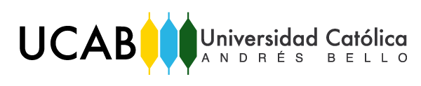

  

# Teoría — Tópicos Especiales de Programación

Apuntes de la asignatura **Tópicos Especiales de Programación** (UCAB).
Notas de clase por unidad, con material de apoyo y diagramas.

## Unidades

- [Introduccion](Introduccion.md)
- [Unidad 0.I - Desarrollo Web](Unidad%200.I%20-%20Desarrollo%20Web.md)
- [Unidad 0.II - Fundamentos-POO](Unidad%200.II%20-%20Fundamentos-POO.md)
- [Unidad I - Paradigmas de Programación](Unidad%20I%20-%20Paradigmas%20de%20Programaci%C3%B3n.md)
- [Unidad II - Composicion, Tipos algebraicos y patrones de d](Unidad%20II%20-%20Composicion%2C%20Tipos%20algebraicos%20y%20patrones%20de%20d.md)
- [Unidad III - Tipos Funcionales y Subtipos](Unidad%20III%20-%20Tipos%20Funcionales%20y%20Subtipos.md)
- [Unidad IV - Aplicaciones avanzadas de los T F](Unidad%20IV%20-%20Aplicaciones%20avanzadas%20de%20los%20T%20F.md)
- [Unidad V - Programacion Generica](Unidad%20V%20-%20Programacion%20Generica.md)
- [Unidad VI - Programacion asíncrona](Unidad%20VI%20-%20Programacion%20as%C3%ADncrona.md)
- [Unidad VII - Monadas y Category Theory](Unidad%20VII%20-%20Monadas%20y%20Category%20Theory.md)
- [Unidad VIII - Programación orientada a aspectos](Unidad%20VIII%20-%20Programaci%C3%B3n%20orientada%20a%20aspectos.md)
- [Unidad IX - Programacion Reactiva](Unidad%20IX%20-%20Programacion%20Reactiva.md)
- [Unidad X - Metaprogramacion](Unidad%20X%20-%20Metaprogramacion.md)

## Patrones de diseño

- [Composite](Patrones/Composite.md)
- [Decorator](Patrones/Decorator.md)
- [Factory](Patrones/Factory.md)
- [Singleton](Patrones/Singleton.md)
- [Strategy](Patrones/Strategy.md)

## Material adicional

- [Manejadores de Paquetes](Unidades%20Adicionales/Unidad%20Adicional%20-%20Manejadores%20de%20Paquetes.md)
- [npm](Unidades%20Adicionales/Unidad%20Adicional%20-%20npm.md)
- [Composicion y Tipos de Datos Alg](Ejercicios/Composicion%20y%20Tipos%20de%20Datos%20Alg.md)
