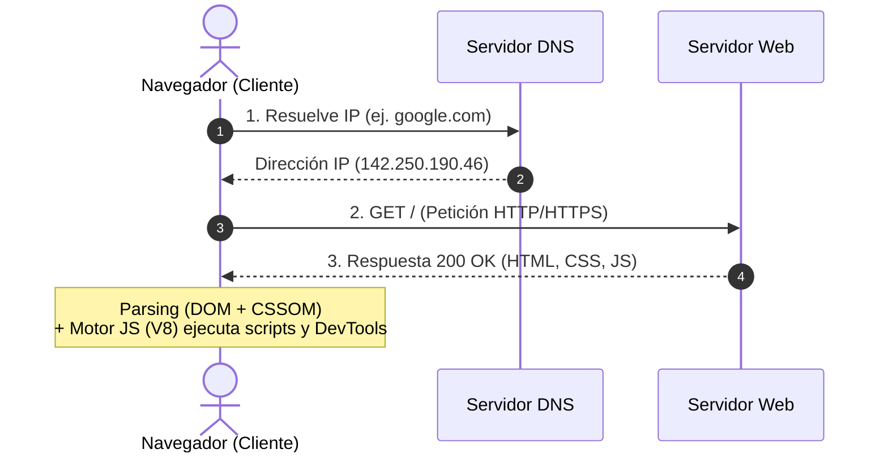
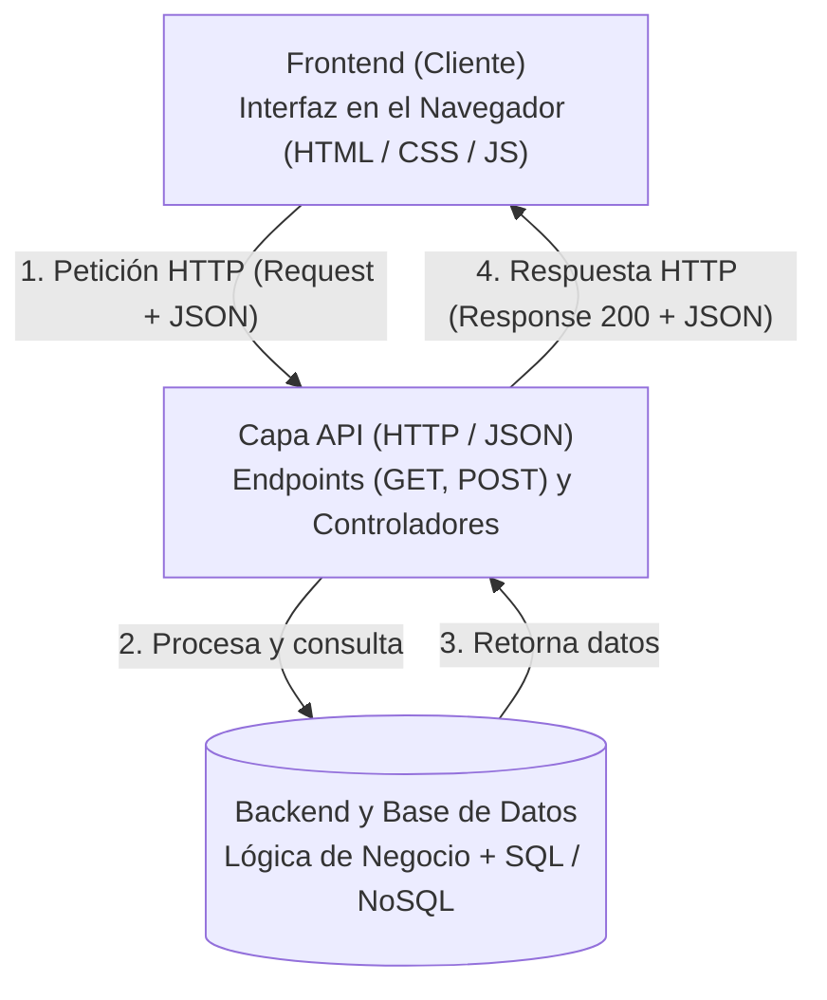
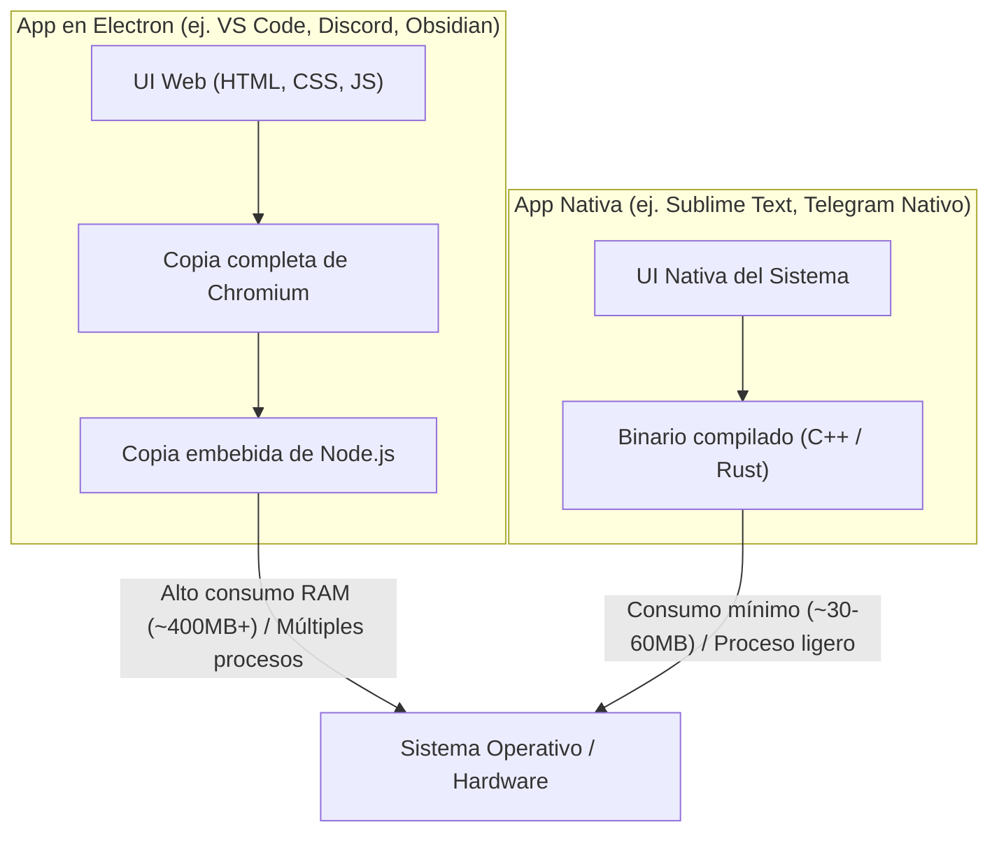
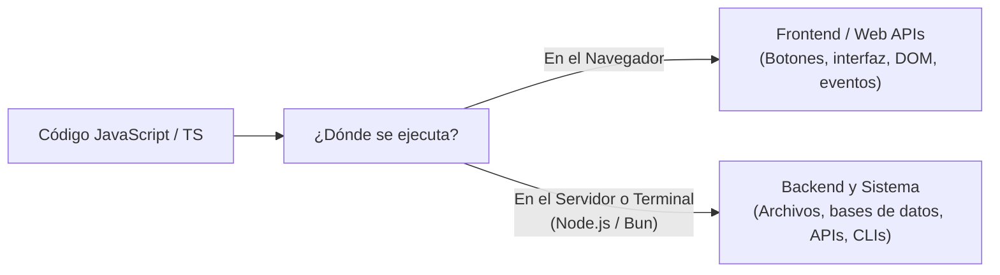

## 1. El Desarrollo Web en el Mundo de Hoy (y en Venezuela)

- **La Web en todos lados:**
	- Ya no son "páginas web" estáticas; son plataformas, SaaS y sistemas distribuidos.
	- La web se convirtió en el runtime universal del software moderno.

- **Datos y métricas reales de la industria:**
	- **98.9% de todos los sitios web:** Según mediciones de W3Techs, casi el 99% de la web mundial utiliza JavaScript como tecnología de ejecución del lado cliente.
	- **12+ años consecutivos en el puesto #1:** En el *Stack Overflow Developer Survey*, JavaScript/TypeScript se mantiene año tras año como el ecosistema de lenguajes más utilizado en el mundo por más del 62-65% de los desarrolladores profesionales.
	- **La herramienta dominante fue hecha con web:** VS Code, el editor de código más usado del planeta (~73% de cuota de mercado en la industria), está programado en TypeScript y corre sobre un motor de navegador.

- **Mercado y salida laboral (Contexto Venezuela):**
	- En reportes internacionales de contratación remota (como Deel, Torre y LinkedIn), el desarrollo web/fullstack lidera como el perfil más contratado en toda América Latina por empresas extranjeras.
	- *Diferencia clave para ingenieros:* La demanda real no busca simples maquetadores visuales, sino ingenieros con capacidad de diseñar arquitecturas escalables, seguridad, consumo de APIs y optimización de rendimiento.

- **Datos curiosos reales:**
	- **Creado en solo 10 días:** En mayo de 1995, Brendan Eich programó la primera versión de JavaScript (originalmente bautizado *Mocha*) en tan solo 10 días para el navegador Netscape Navigator 2.0. Nadie imaginó que un lenguaje diseñado en semana y media para animaciones básicas terminaría ejecutando sistemas bancarios y servidores globales.
	- **La Ley de Atwood (2007):** Postulado de Jeff Atwood (cofundador de Stack Overflow): *"Cualquier aplicación que pueda ser escrita en JavaScript, eventualmente será escrita en JavaScript"*. Hoy en día corren en el navegador desde suites de diseño complejas como Figma hasta emuladores de consolas, bases de datos completas y modelos de Inteligencia Artificial locales (vía WebAssembly y WebGPU).

Que tantas cosas corran en la web no es precisamente lo mejor, de hecho es un tema bastante controversial. Lo veremos más adelante...

- **Dinámica / Pregunta al aula:**
	- *¿Quiénes ya han construido algo para la web? ¿Con qué tecnologías?*
	- *¿Qué porcentaje de las aplicaciones que usan al día dependen de tecnologías web?* (aquí viene el punch de Discord, VS Code, Slack y más)

---

## 2. Los Pilares del Frontend: HTML, CSS, JavaScript (y TypeScript)

- **HTML (HyperText Markup Language) — La Estructura:**
	- No es un lenguaje de programación: es un lenguaje de marcado semántico basado en etiquetas.
	- Define qué elementos componen la página (títulos, formularios, botones, tablas).
	- *Analogía:* El esqueleto y los órganos.

- **CSS (Cascading Style Sheets) — El Diseño:**
	- Lenguaje declarativo basado en reglas de estilo y cascada.
	- Se encarga del layout (Flexbox, Grid), tipografía, colores y adaptabilidad visual (Responsive Design).
	- *Analogía:* La piel, la ropa y el aspecto exterior.

- **JavaScript — La Lógica y el Comportamiento:**
	- El único lenguaje de programación interpretado de forma nativa por los navegadores.
	- Maneja eventos del usuario, modifica la estructura en tiempo real y gestiona peticiones asíncronas.
	- *Analogía:* El sistema nervioso y los músculos.

*El DOM: el navegador convierte el HTML en un árbol de nodos, y JavaScript lo selecciona y modifica.*

- **¿Qué pasa con TypeScript?:**
	- **Es básicamente JavaScript con superpoderes:** No es un lenguaje ajeno ni un runtime diferente.
	- Es un *superset* (superconjunto) que agrega tipado estático, interfaces y análisis en tiempo de desarrollo.
	- **Dato clave para ingenieros:** El navegador **no entiende TypeScript**. Todo código TS se transpila a JavaScript plano antes de ejecutarse en el cliente o servidor.
	- ¿Por qué es el estándar de la industria?: Reduce drásticamente bugs en producción, mejora el mantenimiento y la experiencia de desarrollo (autocompletado, refactorización segura).

- **¿Existen otros lenguajes para la Web?:**
	- **Históricamente en el navegador:** Se intentó introducir Java (Applets), ActionScript (Flash), Silverlight y Dart. Todos fracasaron y quedaron obsoletos frente al estándar abierto de JavaScript.
	- **El presente y futuro: WebAssembly (Wasm):** Permite compilar lenguajes como C, C++, Rust o Go a un formato binario de bajo nivel que corre en el navegador a velocidad casi nativa. *Nota importante:* No reemplaza a JS, sino que colabora con él en tareas pesadas (edición de video, Figma, motores de videojuegos, IA en el cliente).
	- **En el Backend:** La web es agnóstica; en el servidor corre cualquier lenguaje (Node.js/TS, Python, Java, Go, C#, PHP, Rust).

*Los tres pilares en acción: HTML (estructura) → CSS (diseño) → JavaScript (lógica).*

---

## 3. ¿De Dónde Viene el Nombre "Web"? (El Puente al Navegador)

- **El origen histórico:**
	- Concebido en 1989 por **Tim Berners-Lee** en el CERN (Ginebra, Suiza).
	- El concepto de **World Wide Web (WWW):** Una enorme "telaraña" global de documentos descentralizados interconectados entre sí mediante hipervínculos (links / hipertexto).
- **El salto conceptual hacia el software:**
	- Si la información existe como una telaraña gigante de textos distribuidos por todo el mundo... ¿cómo hace una persona para recorrerla?
	- Surge la necesidad de un software especializado para "navegar" de un nodo de la red a otro: el **Navegador Web (Web Browser)**.

---

## 4. ¿Cómo Funciona un Navegador Web?

- **El ciclo de vida de una petición:**
	- URL / Dominio $\to$ Resolución DNS $\to$ Servidor $\to$ Respuesta HTTP (HTML, CSS, JS, assets).
- **Motores del navegador:**
	- **Motor de renderizado:** Parsing de HTML/CSS $\to$ DOM + CSSOM $\to$ Render Tree $\to$ Layout $\to$ Paint (Chromium/Blink, Firefox/Gecko, Safari/WebKit).
	- **Motor de ejecución JS:** V8, SpiderMonkey, JavaScriptCore.
- **La Consola del Navegador (DevTools):**
	- No es solo un visor de errores: es un **entorno REPL interactivo** de JavaScript con acceso directo al DOM de la página en ejecución.
	- *Demo rápida en clase:* Abrir DevTools (`F12`), inspeccionar elementos, modificar texto en vivo y ejecutar comandos en la consola.

---

## 5. Arquitectura Básica: Frontend vs. Backend

- **Frontend (Lado del Cliente):**
	- Lo que corre en la máquina del usuario (dentro del navegador).
	- Renderiza la interfaz y reacciona a las acciones del usuario.
- **Backend (Lado del Servidor):**
	- Lo que corre en servidores remotos / contenedores / nube.
	- Responsabilidades: Reglas de negocio, persistencia (Bases de Datos SQL / NoSQL), seguridad, autenticación, procesamiento pesado.
	- Ecosistema: Node.js/TS, Python, Java, Go, C#, PHP, Rust, etc.

---

## 6. El Puente de Comunicación: APIs

- **¿Qué es una API en la web?:**
	- Interfaz de comunicación estructurada entre el cliente (Frontend) y el servidor (Backend).
- **El protocolo y el formato:**
	- Peticiones sobre **HTTP/HTTPS** (`GET`, `POST`, `PUT`, `DELETE`).
	- Intercambio de datos estándar: **JSON** (JavaScript Object Notation).
- **Arquitecturas comunes:**
	- REST (estándar tradicional), GraphQL (consultas flexibles), WebSockets (tiempo real bidireccional).
- **¿Construir o consumir APIs se considera "programación web"?:**
	- **Rotundamente sí (en el caso de Web APIs):** Existe la falsa creencia de que el desarrollo web se limita a maquetar interfaces visuales (Frontend).
	- Una **Web API** (REST, GraphQL, etc.) es **desarrollo web backend en sentido estricto**: opera sobre la infraestructura estándar de la Web (protocolo HTTP/HTTPS, URLs/endpoints, métodos y códigos de estado), aunque no produzca una sola línea de HTML o CSS.
	- **El caso de las Apps Móviles (¿Por qué sigue siendo web?):**
		- Una API creada en Node.js, Python o Go puede alimentar a una aplicación móvil nativa (iOS con Swift, Android con Kotlin) o a dispositivos IoT.
		- **Sigue siendo desarrollo web** porque la comunicación viaja enteramente por la infraestructura de la Web (HTTP/HTTPS). Para el servidor, el cliente es *agnóstico*: no importa si la petición proviene de Chrome, de un iPhone o de una consola; el backend resuelve problemas propios de la arquitectura web (rutas, cabeceras, DNS, balanceo de carga, latencia y seguridad).
	- *Distinción teórica importante:* El concepto de **API** en general no es exclusivo de la web (existen APIs de sistemas operativos como Win32 o POSIX, APIs de hardware y APIs de bibliotecas estándar). Sin embargo, una **Web API / HTTP API** es la columna vertebral de la Web moderna (comunicación *Machine-to-Machine* y *Client-to-Server*).
- *Analogía rápida:* El restaurante — Cliente (Frontend), Mesonero (API / HTTP Request), Cocina (Backend y Base de Datos).

---

## 7. La Web Conquista el Escritorio: El Fenómeno Electron

- **¿Qué es Electron?:**
	- Framework para crear aplicaciones de escritorio multiplataforma combinando **Chromium** (renderizado/UI) + **Node.js** (acceso al sistema operativo/archivos).
- **Aplicaciones masivas hechas en Electron:**
	- **VS Code** (el editor que usamos en clase).
	- **Discord**, **Slack**, **Spotify**, **WhatsApp Desktop**, **Postman**, **Figma** (wrapper).
	- Incluso **Obsidian**
- **La gran ventaja de negocio:**
	- *Write once, run everywhere.* Un solo equipo de desarrolladores web crea la app para Web, Windows, macOS y Linux al mismo tiempo.

---

## 8. La Controversia: "El Odio hacia Electron"

- **¿Por qué genera tanto rechazo entre desarrolladores y usuarios avanzados?:**
	- **Consumo de memoria RAM:** Cada app en Electron corre su propia instancia de Chromium y Node. Tener abiertas 4 apps Electron = 4 navegadores corriendo en segundo plano.
	- **Peso de distribución:** Un "Hola Mundo" pesa fácilmente 100MB+ (lleva un navegador entero adentro).
	- **Rendimiento e impacto de batería:** Consumo de CPU y energía muy superior a aplicaciones nativas escritas en C++, Rust, Swift o C#.
- **La perspectiva del Ingeniero de Software:**
	- *Trade-off:* Velocidad de desarrollo y mantenimiento unificado **VS** eficiencia de recursos del hardware.
	- Alternativas modernas más ligeras: **Tauri** (usa el WebView nativo del SO + backend en Rust), Flutter Desktop.
- *Pregunta debate para la clase:*
	- *Si consume tanta RAM, ¿por qué Microsoft no reescribe VS Code en C++ o C#?*

---

## 9. JavaScript Más Allá del Navegador: El Concepto de "Runtime"

- **La duda clásica:**
	- *"Si JavaScript nació para páginas web... ¿cómo es que hoy programa servidores, herramientas de terminal y aplicaciones de escritorio?"*
	- La respuesta clave: **JavaScript es solo el lenguaje; el entorno donde corre (Runtime) es quien decide qué puede hacer.**

- **El Lenguaje vs. El Entorno (Runtime):**
	- **El Lenguaje (JavaScript):** Solo define la lógica pura (variables, funciones, bucles, objetos). No sabe qué es un botón ni qué es un archivo en el disco.
	- **El Runtime (El contexto donde vive):** Le entrega los "superpoderes" según la plataforma:
		- **En el Navegador (Frontend):** Le da acceso visual: modificar la pantalla (DOM), escuchar clicks y navegar. Por seguridad, no puede tocar tus archivos locales.
		- **En el Servidor / Computadora (Node.js, Bun):** Le da acceso al sistema: leer y guardar archivos, conectarse a bases de datos y crear APIs de red.

- **La conclusión para ingenieros:**
	- Con el nacimiento de **Node.js** (2009), JavaScript dejó de ser un simple "lenguaje de páginas" y se convirtió en un lenguaje de propósito general.
	- Con la misma sintaxis que aprendes para hacer una página web, hoy puedes construir servidores backend, herramientas de consola (como `npm`) o software de escritorio completo.

