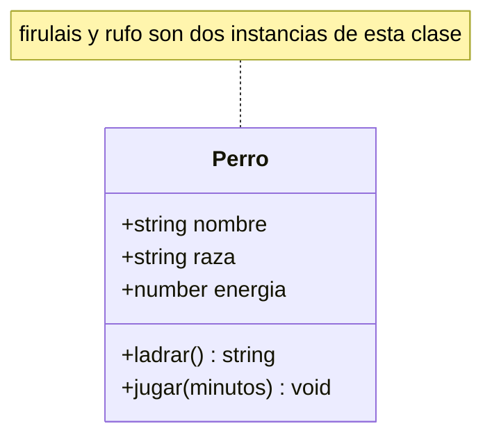
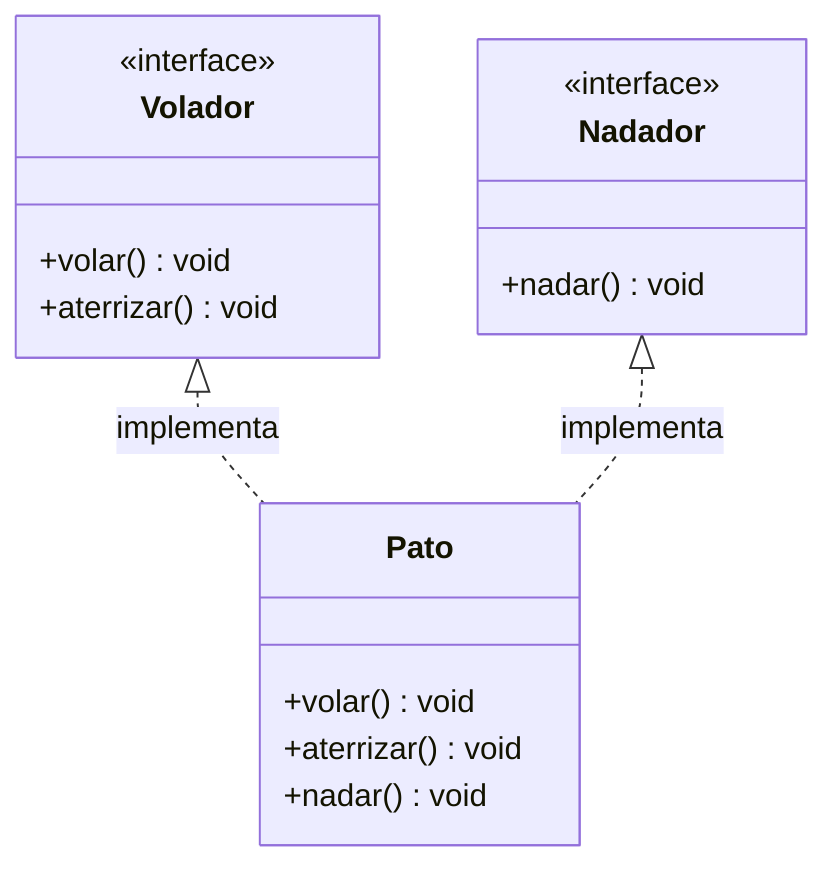
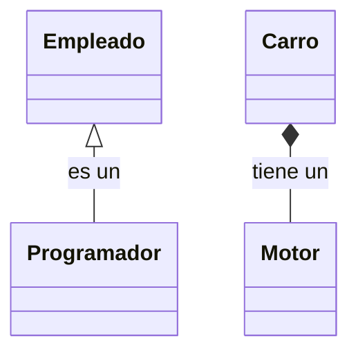
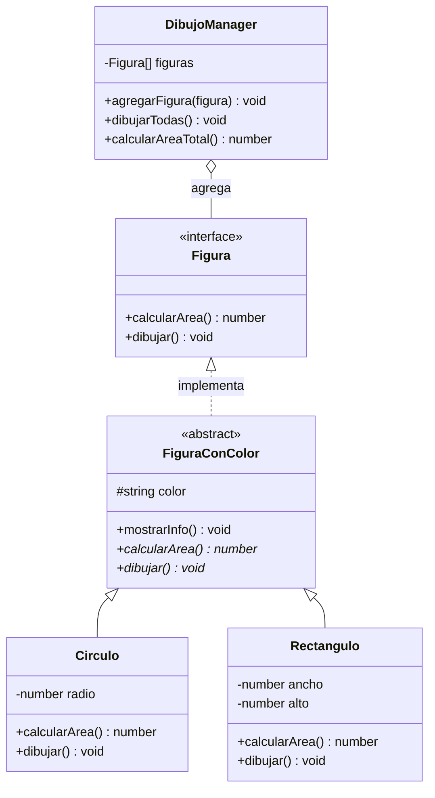

Antes de adentrarnos en los patrones específicos, necesitamos reforzar los conceptos fundamentales de la Programación Orientada a Objetos que hacen posible estos patrones. **Los patrones de diseño no son trucos mágicos**: son soluciones elegantes que aprovechan las características más poderosas de la POO.

**Objetivos de esta unidad — al terminarla deberías poder:**

- Reconocer **polimorfismo, herencia, composición y encapsulación** en código real, no solo en teoría.
- Decidir con criterio cuándo usar una **interfaz** y cuándo una **clase abstracta**.
- Identificar código **ACOPLADO** a una implementación concreta y refactorizarlo hacia abstracciones.

---

## 1. POO 101


Lo mínimo indispensable antes de cualquier otra cosa:

- **Clase**: el *molde* o plano. Define qué datos y qué comportamientos tendrán sus objetos; todavía no es algo que exista en el programa.
- **Objeto** (instancia): un ejemplar concreto construido a partir de la clase. De una clase puedes crear muchos.
- **Atributo** (propiedad): los *datos* que guarda cada objeto. Definen su estado.
- **Método**: las *acciones* que el objeto sabe hacer. Normalmente operan sobre sus propios atributos.
- **Constructor**: el método especial que crea e inicializa el objeto.

> **Analogía**: la clase es el plano de una casa; cada objeto es una casa ya construida. El plano es uno, las casas pueden ser muchas y cada una pintada distinto. Los **atributos** son los cuartos y lo que hay dentro; los **métodos** son las cosas que se pueden hacer en la casa (abrir la puerta, encender la luz).

```typescript
class Perro {
    // Atributos: el estado de cada perro
    nombre: string;
    raza: string;
    energia: number;

    // Constructor: se ejecuta al crear el objeto
    constructor(nombre: string, raza: string) {
        this.nombre = nombre;
        this.raza = raza;
        this.energia = 100;
    }

    // Métodos: lo que el perro sabe hacer
    ladrar(): string {
        return `${this.nombre} dice: ¡Guau!`;
    }

    jugar(minutos: number): void {
        this.energia -= minutos * 2;
    }
}

// Crear objetos (instanciar)
const firulais = new Perro("Firulais", "Mestizo");
const rufo = new Perro("Rufo", "Beagle");

console.log(firulais.ladrar()); // "Firulais dice: ¡Guau!"
rufo.jugar(10);
console.log(rufo.energia); // 80
```

`firulais` y `rufo` son **dos objetos distintos de la misma clase**: comparten la estructura, pero cada uno tiene su propio estado.



> **Diagrama de clases (UML)**: el bloque tiene tres zonas —nombre de la clase, atributos y métodos—. El `+` significa `public`. 

**Pregunta al aula**
- *¿Cuántos objetos creen que existen a la vez en un videojuego? ¿Y en WhatsApp?*

---

## 2. El Polimorfismo: La Base de la Flexibilidad


**Definición**: La capacidad de que objetos de diferentes tipos respondan al mismo mensaje (método) de maneras distintas.

```typescript
interface Animal {
    hacerSonido(): string;
}

class Perro implements Animal {
    hacerSonido(): string {
        return "¡Guau!";
    }
}

class Gato implements Animal {
    hacerSonido(): string {
        return "¡Miau!";
    }
}

// Polimorfismo en acción
function hacerRuidoAnimal(animal: Animal): void {
    console.log(animal.hacerSonido()); // No sabe QUÉ animal es, pero sabe QUÉ puede hacer
}

const miPerro: Animal = new Perro();
const miGato: Animal = new Gato();

hacerRuidoAnimal(miPerro); // "¡Guau!"
hacerRuidoAnimal(miGato);  // "¡Miau!"
```

> **Nota sobre TypeScript**: aquí `miPerro` se declara como `Animal` (la interfaz), no como `Perro`. Esto funciona porque TypeScript usa **tipado estructural**: a un objeto le basta "tener la forma" del contrato, no hace falta declarar herencia explícita.

**El contraste sin polimorfismo**: podrías resolver lo mismo con un `switch` sobre un tipo (`"perro" | "gato"`) o con una cadena de `if-else`. El problema no es que sea imposible, es que **cada tipo nuevo obliga a tocar todos los puntos que deciden el comportamiento**. Con polimorfismo, el comportamiento vive en cada clase y el código que las usa no cambia.

**Por qué importa para los patrones:**
- Te permite escribir código que funciona con "familias" de objetos sin conocer sus tipos específicos.
- Es la base del patrón Strategy, Factory y muchos otros.
- Agregar un nuevo tipo de animal no toca `hacerRuidoAnimal`: solo se crea una clase nueva que cumpla la interfaz.

> **Encapsulación**: el polimorfismo funciona *porque* cada objeto encapsula su propio estado. `hacerRuidoAnimal` solo envía el mensaje `hacerSonido()`; no lee cuántas patas tiene el animal ni toca sus atributos internos. Cada objeto decide cómo responder y se encarga de mantener su estado válido. Si el llamador tuviera que inspeccionar los campos (`nombre`, `energia`) para decidir qué hacer, ya no habría polimorfismo: volvería a estar acoplado a la estructura de cada tipo.

### Dinámica / Pregunta al aula

- *¿Dónde han visto un `switch` que crece cada vez que aparece un tipo nuevo? ¿Cómo lo resolverían con polimorfismo?*

---

## 3. Interfaces vs Clases Abstractas: Contratos vs Herencia Parcial

### Interfaces: Contratos Puros

```typescript
interface Volador {
    volar(): void;
    aterrizar(): void;
}

interface Nadador {
    nadar(): void;
}

// Un pato puede volar Y nadar
class Pato implements Volador, Nadador {
    volar(): void { console.log("El pato vuela"); }
    aterrizar(): void { console.log("El pato aterriza"); }
    nadar(): void { console.log("El pato nada"); }
}
```



`Pato` realiza **dos** contratos a la vez: por eso las interfaces son clave para roles que no comparten una jerarquía común.

### Clases Abstractas: Herencia con Implementación Parcial

```typescript
abstract class Vehiculo {
    protected velocidad: number = 0;

    // Método concreto: todos los vehículos aceleran igual
    acelerar(): void {
        this.velocidad += 10;
        console.log(`Velocidad: ${this.velocidad} km/h`);
    }

    // Método abstracto: cada vehículo arranca diferente
    abstract arrancar(): void;
}

class Auto extends Vehiculo {
    arrancar(): void {
        console.log("Girando la llave del auto");
    }
}

class Moto extends Vehiculo {
    arrancar(): void {
        console.log("Pateando el arranque de la moto");
    }
}
```

> **Analogía**: la interfaz es el **contrato notariado** (solo exige, no aporta nada). La clase abstracta es un **manual con las partes ya resueltas** más los huecos que el hijo debe llenar.

### Cuándo usar cada una

| Criterio             | Interfaz                                               | Clase abstracta                                        |
| -------------------- | ------------------------------------------------------ | ------------------------------------------------------ |
| Qué define           | Contrato puro: *qué puede hacer*                       | Herencia parcial: contrato + implementación            |
| Implementación       | Ninguna                                                | Métodos concretos + abstractos                         |
| Herencia múltiple    | Sí (una clase implementa varias)                       | No (una sola clase base)                               |
| Estado               | No                                                     | Sí (atributos `protected`/`private`)                   |
| Relación entre tipos | No relacionados que comparten un **rol**               | Jerarquía real con lógica común                        |
| Cuándo elegirla      | Cuando varios tipos distintos comparten comportamiento | Cuando hay código que quieres reutilizar entre "hijos" |

**Qué aportan a los patrones:**
- Las interfaces definen "qué puede hacer" un objeto sin importar "cómo lo hace".
- Las clases abstractas permiten compartir código común mientras fuerzan comportamientos específicos.
- Son la base de Strategy y Factory Method (interfaz) y de Template Method (clase abstracta).

---

## 4. Herencia y Composición: "Es un" vs "Tiene un"


La diferencia se ve mejor en un diagrama:



La flecha con triángulo hueco (`<|--`) es **herencia**; el rombo relleno (`*--`) es **composición**.

### Herencia: Relación "Es un"

```typescript
class Empleado {
    protected nombre: string;
    protected salario: number;

    constructor(nombre: string, salario: number) {
        this.nombre = nombre;
        this.salario = salario;
    }

    trabajar(): string {
        return `${this.nombre} está trabajando`;
    }
}

class Programador extends Empleado {
    private lenguaje: string;

    constructor(nombre: string, salario: number, lenguaje: string) {
        super(nombre, salario);
        this.lenguaje = lenguaje;
    }

    // Sobrescribe el método padre
    trabajar(): string {
        return `${this.nombre} está programando en ${this.lenguaje}`;
    }

    // Método específico de programador
    debuggear(): string {
        return `${this.nombre} está cazando bugs`;
    }
}
```

### Composición: Relación "Tiene un"

La clave de la composición **no es solo "tener" un objeto dentro, sino poder decidir cuál** sin reeditar al dueño. Por eso el motor se **inyecta** en vez de crearse adentro:

```typescript
interface Motor {
    encender(): string;
}

class MotorGasolina implements Motor {
    constructor(private cilindros: number) {}

    encender(): string {
        return `Motor de ${this.cilindros} cilindros encendido`;
    }
}

class MotorElectrico implements Motor {
    constructor(private bateriaKwh: number) {}

    encender(): string {
        return `Motor eléctrico de ${this.bateriaKwh} kWh activado`;
    }
}

class Carro {
    constructor(private motor: Motor) {}

    arrancar(): string {
        return this.motor.encender(); // Delega al motor
    }
}

const deGasolina = new Carro(new MotorGasolina(4));
const electrico = new Carro(new MotorElectrico(75));
```

Fíjate en la diferencia: si `Carro` hiciera `new MotorGasolina(4)` adentro, cambiar el motor obligaría a editar `Carro`. **Inyectándolo, el carro no sabe ni le importa qué motor recibió.**

**El rol de la composición en los patrones:**
- Es más flexible que la herencia: puedes cambiar el motor sin tocar el carro.
- Es la base de Strategy, Decorator y Composite.
- **"Favorece composición sobre herencia" es uno de los principios más importantes del diseño de software.**

### Pregunta al aula

- *¿Una Playlist es un Array (con canciones adentro) o tiene un Array de canciones?*

---

## 5. El Principio de Inversión de Dependencias en Acción

**Problema**: Código rígido y difícil de cambiar.

```typescript
// MAL: Alto acoplamiento a una implementación concreta
class EmailService {
    enviar(mensaje: string): void {
        console.log(`Enviando email: ${mensaje}`);
    }
}

class NotificacionManager {
    private emailService: EmailService = new EmailService(); // Dependencia fija

    notificar(mensaje: string): void {
        this.emailService.enviar(mensaje); // Solo puede enviar emails
    }
}
```

**Solución**: Inversión de dependencias.

```typescript
// BIEN: Bajo acoplamiento
interface ServicioNotificacion {
    enviar(mensaje: string): void;
}

class EmailService implements ServicioNotificacion {
    enviar(mensaje: string): void {
        console.log(`Email: ${mensaje}`);
    }
}

class SMSService implements ServicioNotificacion {
    enviar(mensaje: string): void {
        console.log(`SMS: ${mensaje}`);
    }
}

class NotificacionManager {
    constructor(private servicio: ServicioNotificacion) {} // Inyección de dependencia

    notificar(mensaje: string): void {
        this.servicio.enviar(mensaje); // Funciona con cualquier implementación
    }
}

// Uso flexible
const emailManager = new NotificacionManager(new EmailService());
const smsManager = new NotificacionManager(new SMSService());
```

> **Inversión (DIP) vs Inyección (DI)**: no son sinónimos. El **DIP** es el *principio* (depender de abstracciones, no de concreciones). La **DI** es la *técnica* con la que lo cumples: entregarle las dependencias al objeto desde afuera (por constructor, setter, etc.) en lugar de que este las fabrique. La DI es el mecanismo que usan Strategy y Factory.

**Cómo habilita los patrones:**
- El código depende de abstracciones, no de implementaciones concretas.
- Es fundamental para Strategy, Factory y Dependency Injection.
- Extensible: puedes agregar un `WhatsAppService` sin tocar una línea de código existente.

---

## 6. Encapsulación: Controlando el Acceso

```typescript
class CuentaBancaria {
    private saldo: number = 0;              // Nadie lo toca directamente
    private readonly titular: string;      // Se asigna una sola vez

    constructor(titular: string) {
        this.titular = titular;
    }

    depositar(cantidad: number): void {
        if (cantidad <= 0) {
            throw new Error("La cantidad debe ser positiva");
        }
        this.saldo += cantidad;
    }

    retirar(cantidad: number): boolean {
        if (cantidad > 0 && cantidad <= this.saldo) {
            this.saldo -= cantidad;
            return true;
        }
        return false; // Fondos insuficientes
    }

    // Getter: solo lectura, sin exponer el campo
    get saldoActual(): number {
        return this.saldo;
    }
}

const cuenta = new CuentaBancaria("Ana");
cuenta.depositar(100);
console.log(cuenta.saldoActual); // 100
// cuenta.saldo = 999999; // Error de compilación: es privado
```


El diagrama resume la idea: el **estado** (`saldo`, `titular`) vive encerrado y desde afuera solo se llega a través de la **interfaz pública**. El acceso directo al estado está bloqueado; los métodos son la vía legítima para cambiarlo.

**Modificadores de acceso en TypeScript:**

| Modificador | Visible desde |
| --- | --- |
| `public` (implícito) | Cualquier parte |
| `protected` | La clase y sus subclases |
| `private` | Solo la propia clase |
| `readonly` | Escritura solo en el constructor (ortogonal a los anteriores) |
| `#campo` | Privacidad **real** en tiempo de ejecución (el `private` de TS solo existe al compilar) |

**Su papel en los patrones:**
- Protege el estado interno y garantiza que el objeto mantenga su integridad.
- Es fundamental para Singleton (controla la creación de instancias).
- Sin encapsulación, cualquier código podría modificar el saldo y crear estados inconsistentes.

---

## 7. Ejercicio Integrador: Sistema de Formas Geométricas

Ahora que hemos repasado los conceptos, veamos cómo se integran:

```typescript
// 1. Interface para el contrato
interface Figura {
    calcularArea(): number;
    dibujar(): void;
}

// 2. Clase abstracta para comportamiento común
abstract class FiguraConColor implements Figura {
    protected color: string;

    constructor(color: string) {
        this.color = color;
    }

    // Método concreto común
    mostrarInfo(): void {
        console.log(`Figura ${this.color} con área: ${this.calcularArea()}`);
    }

    // Métodos abstractos que deben implementar las subclases
    abstract calcularArea(): number;
    abstract dibujar(): void;
}

// 3. Implementaciones concretas
class Circulo extends FiguraConColor {
    constructor(private radio: number, color: string) {
        super(color);
    }

    calcularArea(): number {
        return Math.PI * this.radio * this.radio;
    }

    dibujar(): void {
        console.log(`Dibujando círculo ${this.color} de radio ${this.radio}`);
    }
}

class Rectangulo extends FiguraConColor {
    constructor(private ancho: number, private alto: number, color: string) {
        super(color);
    }

    calcularArea(): number {
        return this.ancho * this.alto;
    }

    dibujar(): void {
        console.log(`Dibujando rectángulo ${this.color} de ${this.ancho}x${this.alto}`);
    }
}

// 4. Polimorfismo en acción
class DibujoManager {
    private figuras: Figura[] = [];

    agregarFigura(figura: Figura): void {
        this.figuras.push(figura);
    }

    dibujarTodas(): void {
        this.figuras.forEach(figura => {
            figura.dibujar(); // Polimorfismo: cada figura se dibuja diferente
        });
    }

    calcularAreaTotal(): number {
        return this.figuras.reduce((total, figura) => {
            return total + figura.calcularArea(); // Polimorfismo: cada figura calcula diferente
        }, 0);
    }
}

// Uso del sistema
const manager = new DibujoManager();
manager.agregarFigura(new Circulo(5, "rojo"));
manager.agregarFigura(new Rectangulo(10, 20, "azul"));

manager.dibujarTodas();
console.log(`Área total: ${manager.calcularAreaTotal()}`);
```



Leyenda: `<<interface>>` y `<<abstract>>` marcan la naturaleza de cada tipo; `#` es `protected` y `-` es `private`. El manager solo conoce la interfaz `Figura` (agregación `o--`), no las clases concretas.

**Por qué este ejemplo es la antesala de los patrones:**
- Todos los conceptos trabajan juntos: contrato, herencia parcial, polimorfismo y encapsulación.
- `DibujoManager` no sabe qué tipos específicos de figuras maneja (polimorfismo).
- Puede agregar nuevas figuras sin modificar el manager (abierto/cerrado).
- Cada figura controla cómo se dibuja y calcula (encapsulación).

---

## 8. Ejercicios Propuestos

1. **Polimorfismo**: crea una interfaz `MetodoPago` con `procesar(monto: number)`. Implementa `Tarjeta`, `PagoMovil` y `Efectivo`. Escribe una función `cobrar(metodo: MetodoPago, monto: number)` que no use ningún `if` sobre el tipo.
2. **Interfaz vs abstracta**: modela `EmpleadoFijo` y `EmpleadoPorHora`. Decide qué parte va en una clase abstracta (ej. el cálculo base del nombre, un método `resumen()` común) y qué parte queda como contrato.
3. **Composición**: refactoriza el `Carro` para que reciba un `Motor` inyectado y agrega un tercer motor (ej. híbrido). Verifica que **no tocas** la clase `Carro`.
4. **Inversión de dependencias**: toma el ejemplo `MAL` de la sección 4 y conviértelo en el `BIEN`. Luego agrega `WhatsAppService` sin modificar `NotificacionManager`.
5. **Encapsulación**: agrega a `CuentaBancaria` una regla "máximo 3 retiros por día" y haz imposible violarla desde fuera de la clase. ¿Qué pasa si alguien intenta `cuenta.saldo = 0`? ¿Y con `#saldo`?

---

## Conexiones

Estos fundamentos son la materia prima de los patrones que vienen:

- **Comportamiento intercambiable** (polimorfismo + composición): [Strategy](Patrones/Strategy.md), [Decorator](Patrones/Decorator.md)
- **Creación centralizada** (interfaces + encapsulación): [Factory](Patrones/Factory.md), [Singleton](Patrones/Singleton.md)
- **Estructuras recursivas** (composición): [Composite](Patrones/Composite.md)
- **Contexto más amplio**: [Unidad I - Paradigmas de Programación](Unidad%20I%20-%20Paradigmas%20de%20Programaci%C3%B3n.md) · [Unidad II - Composicion, Tipos algebraicos y patrones de d](Unidad%20II%20-%20Composicion%2C%20Tipos%20algebraicos%20y%20patrones%20de%20d.md)

---

*Material realizado con IA.*

**Tags:** #poo #patrones #fundamentos #typescript
