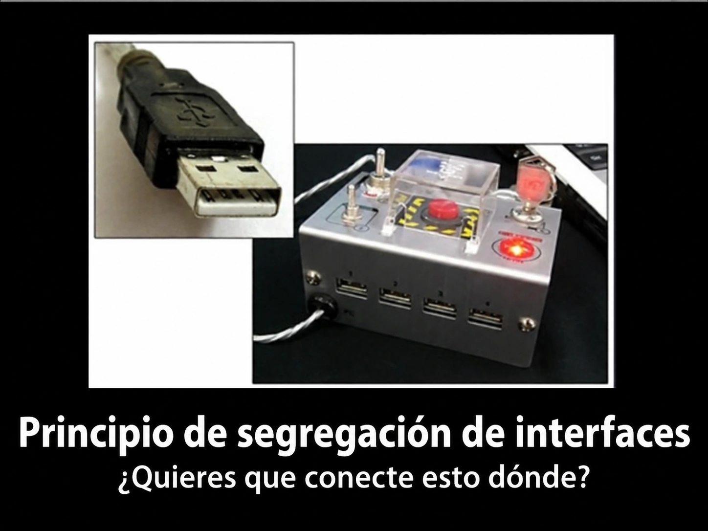
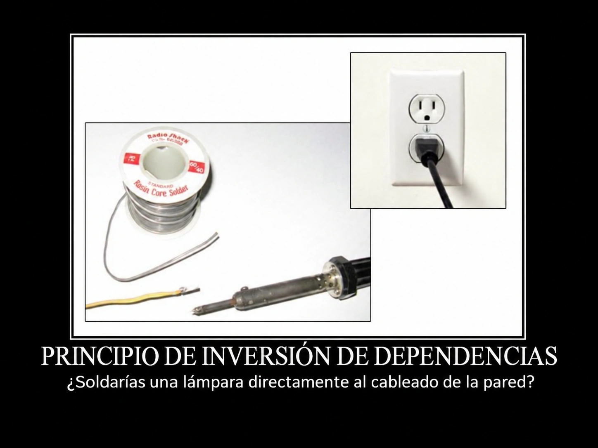

> [!NOTE] Sobre esta unidad
> Esta clase está basada en el Capítulo 10 del libro "Dependency Injection Principles, Practices, and Patterns" de Mark Seeman y Steven van Deursen. El enfoque es aplicar AOP **mediante diseño SOLID**, sin necesidad de herramientas especializadas.

## Objetivos de Aprendizaje

Al finalizar esta unidad, serás capaz de:
- Comprender qué es AOP y por qué es valioso
- Aplicar los principios SOLID para diseñar código mantenible
- Identificar violaciones de SOLID que dificultan el mantenimiento
- Aplicar refactorizaciones progresivas para lograr diseños AOP-friendly
- Implementar Cross-Cutting Concerns usando el patrón Decorator
- Separar comandos y queries siguiendo CQS

---

## 1. ¿Qué es Aspect-Oriented Programming?

Alguien en reddit lo definió así:

Supongamos que quieres que tu código registre (log) cada vez que entra y sale de una función, para absolutamente todas las funciones de tu base de código. ¿Cómo puedes hacer eso? Obviamente, podrías escribir tediosamente esas instrucciones al principio y al final de cada función. Podrías buscar cuidadosamente cosas como los retornos anticipados (early returns) y asegurarte de registrar también en esos lugares. Pero eso es mucho trabajo y un enorme dolor de cabeza para el mantenimiento.

La AOP (Programación Orientada a Aspectos) proporciona una manera de decir declarativamente que deseas agregar esas instrucciones de registro en esas ubicaciones, y automáticamente reescribirá tu código para hacerlo. Esto podría hacerse como parte de la compilación o podría hacerse a medida que tu código se carga en el proceso en ejecución. De este modo, obtienes el beneficio del registro sin la carga de mantenimiento de tener una tonelada de instrucciones de logging al inicio y al final de tus funciones.

El registro (logging) es quizás el caso más obvio debido a su naturaleza extremadamente transversal (cross-cutting). La AOP también se puede utilizar, por ejemplo, para comprobaciones de autorización. Puedes indicar que ciertas funciones deben, antes de ejecutarse, verificar que el usuario realmente pueda realizar la acción deseada. Si no pueden, entonces la función debería lanzar una excepción. Una vez más, esta es una preocupación transversal que preferirías centralizar de alguna manera.

Para eso es buena la AOP. Es útil cuando quieres aplicar la misma lógica en muchos lugares distintos de tu base de código. La AOP te permite "declarar" las reglas y luego dejar que el sistema de tejido de aspectos (aspect weaving system) aplique esas reglas en todos los lugares correctos.

La AOP tiene la desventaja de ser "magia" que no está claramente presente en el código que ve el desarrollador. Para entender el comportamiento del sistema, el desarrollador tiene que ser consciente de que el tejido de aspectos está ocurriendo.

Así que la AOP es un compromiso (tradeoff). Puede reducir la carga de mantenimiento del código, a riesgo de hacer el sistema potencialmente más difícil de entender y, ciertamente, haciendo que el comportamiento en tiempo de compilación o de carga sea más complejo.

### La Cocina Profesional

Imagina la diferencia entre cocinar en casa y trabajar en una cocina profesional:

En casa haces todo tu mismo, buscas ingredientes mientras cocinas, tienes interrupciones constantes y es difícil escalar si tienes muchos invitados.
En cambio, en una cocina profesional, cada estación tiene su especialista, todo está preparado de antemano (*mise en place*), el flujo de trabajo está optimizado y es fácil agregar más personal si es necesario.

**En el código pasa lo mismo**: cuando cada método hace "de todo" (logging, seguridad, transacciones, lógica de negocio), el código se vuelve difícil de mantener. AOP es como organizar una cocina profesional: **cada aspecto tiene su lugar dedicado**.

**Aspect-Oriented Programming (AOP)** es un paradigma que busca reducir la **duplicación de código** necesaria para implementar **Cross-Cutting Concerns** (preocupaciones transversales).

### Cross-Cutting Concerns (preocupaciones transversales)

Son funcionalidades que "atraviesan" múltiples partes de la aplicación:

- **Seguridad** (autorización, autenticación)
- **Auditoría** (logging de operaciones)
- **Transacciones** (begin/commit/rollback)
- **Cache** (almacenamiento temporal de resultados)
- **Validación** (verificación de reglas de negocio)
- **Circuit Breaker** (manejo de fallos en servicios externos)

### El Problema: Código Repetitivo

```typescript
class ProductService {
  deleteProduct(id: string): void {
    this.logger.log(`Deleting product ${id}`); // 📝 Auditoría
    this.checkPermissions(); // Seguridad
    
    try {
      this.repository.delete(id);
      this.breaker.succeed(); // Circuit Breaker
    } catch (error) {
      this.breaker.trip(error); // Circuit Breaker
      throw error;
    }
  }
  
  insertProduct(product: Product): void {
    this.logger.log(`Inserting product`); // Auditoría (REPETIDO)
    this.checkPermissions(); // Seguridad (REPETIDO)
    
    try {
      this.repository.insert(product);
      this.breaker.succeed(); // Circuit Breaker (REPETIDO)
    } catch (error) {
      this.breaker.trip(error); // Circuit Breaker (REPETIDO)
      throw error;
    }
  }
  
  // ... más métodos con el MISMO patrón repetido
}
```

> **Violación del DRY**: Don't Repeat Yourself - cada aspecto está duplicado en múltiples lugares.

Y ademas de eso, el código de negocio queda "ensuciado" con lógica de aspectos, dificultando su comprensión y mantenimiento.

Por eso, hablamos de orientar el diseño de nuestro software hacia los aspectos. Al igual que como podemos orientar el diseno del software hacia otras preocupaciones, como la programacion orientada al dominio (DDD) o la programacion orientada a pruebas (TDD).

No veremos esto en la materia pero en un futuro (muy cercano) escucharan esto mas a fondo

#### Domain-Driven Design (DDD)

**Idea central**: El código debe reflejar el lenguaje y las reglas del negocio.

```typescript
// Sin DDD: código técnico que no comunica el negocio
class OrderService {
  process(o: Order): void {
    if (o.total > 1000 && o.customer.type === 'premium') {
      o.discount = o.total * 0.15;
    }
    // ¿Qué regla de negocio es esta? 🤷
  }
}

// Con DDD: el código habla el lenguaje del dominio
class Order {
  applyPremiumDiscount(): void {
    if (this.qualifiesForPremiumDiscount()) {
      this.discount = new PremiumDiscount(this.total);
    }
  }
  
  private qualifiesForPremiumDiscount(): boolean {
    return this.total.exceeds(Money.of(1000)) 
        && this.customer.isPremium();
  }
}
```

**DDD se enfoca en separar el código de dominio de la infraestructura**.

- **Dominio**: La lógica de negocio pura, sin detalles técnicos
- **Infraestructura**: Detalles técnicos como bases de datos, servicios externos, logging, etc.

La idea es que el dominio no dependa de la infraestructura, sino al revés.

#### Test-Driven Development (TDD)

**Idea central**: Escribir tests **antes** del código de producción.

```typescript
// Primero: escribes el test (RED - falla)
describe('Order', () => {
  it('should apply 15% discount for premium customers over $1000', () => {
    const customer = new Customer({ type: 'premium' });
    const order = new Order(customer, Money.of(1500));
    
    order.applyPremiumDiscount();
    
    expect(order.discount.amount).toBe(225); // 15% de 1500
  });
});

// Después: escribes el código mínimo para pasar (GREEN)
// Finalmente: refactorizas manteniendo los tests verdes (REFACTOR)
```

El diseño que habilita AOP (interfaces pequeñas, decorators) también hace el código **testeable**. Puedes testear cada aspecto y cada handler por separado.

#### El Ciclo Virtuoso

```
         DDD
    (qué modela)
         ↓
    ┌─────────┐
    │ Código  │ ← TDD (cómo se construye)
    │ Limpio  │
    └─────────┘
         ↑
        AOP
  (cómo se estructura)
```

| Enfoque | Pregunta que responde | Beneficio principal |
|---------|----------------------|---------------------|
| **DDD** | ¿Qué conceptos del negocio modelamos? | Código que habla el idioma del cliente |
| **TDD** | ¿Cómo verificamos que funciona? | Confianza para cambiar el código |
| **AOP** | ¿Cómo organizamos las responsabilidades? | Código mantenible y extensible |

---

## 2. Los Principios SOLID en Profundidad


Antes de refactorizar hacia AOP, debemos dominar los principios SOLID. Estos principios son la **base** que permite aplicar AOP mediante diseño.

### 2.1 Single Responsibility Principle (SRP)


> *"Una clase debe tener una, y solo una, razón para cambiar."*
> — Robert C. Martin

La *cohesión*. Una clase cohesiva agrupa funcionalidades que están **funcionalmente relacionadas**. Si puedes mover parte de una clase a otra sin romper nada, probablemente tienes **baja cohesión**. 

¿Esto es bueno o malo? ¿Deberiamos buscar alta o baja cohesión?

Una clase con alta cohesión significa que todos sus métodos y atributos trabajan juntos hacia un objetivo común.

#### Violación del SRP

```typescript
class UserService {
  constructor(private db: Database, private emailClient: EmailClient,
    private logger: Logger
  ) {}

  createUser(name: string, email: string): User {
    // Razón 1: Lógica de negocio de usuarios
    const user = new User(name, email);
    // Razón 2: Persistencia
    this.db.query(`INSERT INTO users VALUES (?, ?)`, [name, email]);
    // Razón 3: Notificaciones
    this.emailClient.send(email, "Welcome!", "Thanks for joining");
    // Razón 4: Logging
    this.logger.info(`User created: ${email}`);
    return user;
  }
}
```

**Problema**: Esta clase tiene **4 razones para cambiar**:
1. Cambios en reglas de negocio de usuarios
2. Cambios en cómo se persiste (otro ORM, otra DB)
3. Cambios en cómo se envían emails
4. Cambios en cómo se hace logging

#### Aplicando SRP

```typescript
// Cada clase tiene UNA responsabilidad
class UserFactory {
  create(name: string, email: string): User {
    return new User(name, email);
  }
}

class UserRepository {
  constructor(private db: Database) {}
  
  save(user: User): void {
    this.db.query(`INSERT INTO users VALUES (?, ?)`, [user.name, user.email]);
  }
}

class WelcomeEmailSender {
  constructor(private emailClient: EmailClient) {}
  
  send(user: User): void {
    this.emailClient.send(user.email, "Welcome!", "Thanks for joining");
  }
}

// Orquestador 
// (también tiene una sola responsabilidad: coordinar)
class CreateUserHandler {
  constructor(
    private factory: UserFactory,
    private repository: UserRepository,
    private welcomeSender: WelcomeEmailSender
  ) {}
  
  execute(name: string, email: string): User {
    const user = this.factory.create(name, email);
    this.repository.save(user);
    this.welcomeSender.send(user);
    return user;
  }
}
```

El concepto de Handler se ira haciendo cada vez mas familiar para ustedes. Un **Handler** es un patrón que encapsula la **lógica de procesamiento** de una operación específica. La palabra "handler" significa "manejador", "procesador" o "orquestador".

- Procesa un tipo específico de comando o mensaje, por eso suele tener un método genérico como `execute()` que realiza la operación completa.
- Recibe sus dependencias (implementaciones concretas) por constructor. A esto se le llama inyección de dependencias.
- La lógica de negocio está pura, por lo tanto no tiene efectos secundarios.

#### Mini-ejercicio

Identifica las **razones para cambiar** en esta clase:

```typescript
class ReportGenerator {
  generateSalesReport(startDate: Date, endDate: Date): void {
    // Obtiene datos de ventas
    const sales = this.db.query(`SELECT * FROM sales WHERE date BETWEEN ? AND ?`, [startDate, endDate]);
    
    // Calcula totales
    const total = sales.reduce((sum, s) => sum + s.amount, 0);
    // Genera HTML
    const html = `<h1>Sales Report</h1><p>Total: ${total}</p>`;
    // Envía por email
    this.emailClient.send("manager@company.com", "Sales Report", html);
    // Guarda en archivo
    fs.writeFileSync(`report-${Date.now()}.html`, html);
  }
}
```

<details>
<summary>💡 Ver respuesta</summary>

**5 razones para cambiar**:
1. Cambios en la consulta SQL (fuente de datos)
2. Cambios en la lógica de cálculo
3. Cambios en el formato del reporte (HTML → PDF)
4. Cambios en el destinatario o método de envío
5. Cambios en dónde/cómo se guarda el archivo

**Refactoring sugerido**: `SalesDataFetcher`, `SalesCalculator`, `ReportFormatter`, `ReportSender`, `ReportStorage`

</details>

---

### 2.2 Open/Closed Principle (OCP)


> *"Las entidades de software deben estar abiertas para extensión, pero cerradas para modificación."*

Poder agregar nuevos comportamientos **sin modificar código existente**. El patrón Decorator es una forma clásica de lograr esto.

#### Violación del OCP

```typescript
class NotificationService {
  send(message: string, type: "email" | "sms" | "push"): void {
    if (type === "email") {
      // Enviar email
      this.emailClient.send(message);
    } else if (type === "sms") {
      // Enviar SMS
      this.smsClient.send(message);
    } else if (type === "push") {
      // Enviar push notification
      this.pushClient.send(message);
    }
    // Para agregar Slack, debo MODIFICAR esta clase
  }
}
```

#### Aplicando OCP

```typescript
// Abstracción
interface INotificationChannel {
  send(message: string): void;
}

// Implementaciones (cerradas para modificación)
class EmailChannel implements INotificationChannel {
  constructor(private client: EmailClient) {}
  send(message: string): void {
    this.client.send(message);
  }
}

class SmsChannel implements INotificationChannel {
  constructor(private client: SmsClient) {}
  send(message: string): void {
    this.client.send(message);
  }
}

// Agregar Slack NO modifica código existente
class SlackChannel implements INotificationChannel {
  constructor(private webhook: string) {}
  send(message: string): void {
    fetch(this.webhook, { method: 'POST', body: JSON.stringify({ text: message }) });
  }
}

// Servicio abierto para extensión
class NotificationService {
  constructor(private channels: INotificationChannel[]) {}
  
  broadcast(message: string): void {
    this.channels.forEach(channel => channel.send(message));
  }
}
```

El concepto de Service tambien se ira haciendo cada vez mas familiar para ustedes. Un **Service** es un patrón que encapsula la **lógica de negocio** relacionada con una funcionalidad específica del dominio. La palabra "service" significa "servicio" o "funcionalidad". En este caso, el Service se encarga de manejar las notificaciones.

Un servicio encapsula un comportamiento **reutilizable**. Mientras que un **Handler** orquesta **un flujo de negocio específico** usando servicios y repositorios

#### Mini-ejercicio OCP

¿Cómo aplicarías OCP a este código?

```typescript
class DiscountCalculator {
  calculate(price: number, customerType: string): number {
    if (customerType === "regular") {
      return price * 0.95; // 5% off
    } else if (customerType === "premium") {
      return price * 0.85; // 15% off
    } else if (customerType === "vip") {
      return price * 0.75; // 25% off
    }
    return price;
  }
}
```

<details>
<summary>💡 Ver respuesta</summary>

```typescript
interface IDiscountStrategy {
  calculate(price: number): number;
}

class RegularDiscount implements IDiscountStrategy {
  calculate(price: number): number {
    return price * 0.95;
  }
}

class PremiumDiscount implements IDiscountStrategy {
  calculate(price: number): number {
    return price * 0.85;
  }
}

class VipDiscount implements IDiscountStrategy {
  calculate(price: number): number {
    return price * 0.75;
  }
}

// ✅ Agregar "StudentDiscount" no requiere modificar nada existente
class StudentDiscount implements IDiscountStrategy {
  calculate(price: number): number {
    return price * 0.80; // 20% off
  }
}

class DiscountCalculator {
  constructor(private strategy: IDiscountStrategy) {}
  
  calculate(price: number): number {
    return this.strategy.calculate(price);
  }
}
```

</details>

---

### 2.3 Liskov Substitution Principle (LSP)


> *"Los objetos de una superclase deben poder ser reemplazados por objetos de sus subclases sin alterar la correctitud del programa."*

Si `B` hereda de `A`, cualquier lugar que use `A` debe funcionar igual con `B`. Los Decorators dependen de esto para funcionar.

#### Violación del LSP

```typescript
class Rectangle {
  constructor(protected width: number, protected height: number) {}
  
  setWidth(w: number): void { this.width = w; }
  setHeight(h: number): void { this.height = h; }
  getArea(): number { return this.width * this.height; }
}

class Square extends Rectangle {
  setWidth(w: number): void {
    this.width = w;
    this.height = w; // Comportamiento inesperado
  }
  setHeight(h: number): void {
    this.height = h;
    this.width = h; // Comportamiento inesperado
  }
}

// Este código falla con Square
function testRectangle(rect: Rectangle): void {
  rect.setWidth(5);
  rect.setHeight(10);
  console.assert(rect.getArea() === 50); // (100)
}
```

#### Aplicando LSP

```typescript
interface IShape {
  getArea(): number;
}

class Rectangle implements IShape {
  constructor(private width: number, private height: number) {}
  getArea(): number { return this.width * this.height; }
}

class Square implements IShape {
  constructor(private side: number) {}
  getArea(): number { return this.side * this.side; }
}

// ✅ Ambas funcionan correctamente donde se espera IShape
function printArea(shape: IShape): void {
  console.log(`Area: ${shape.getArea()}`);
}
```

#### Mini-ejercicio LSP

¿Por qué este Decorator viola LSP?

```typescript
interface IRepository<T> {
  getById(id: string): T;
  save(entity: T): void;
}

class ReadOnlyRepositoryDecorator<T> implements IRepository<T> {
  constructor(private decoratee: IRepository<T>) {}
  
  getById(id: string): T {
    return this.decoratee.getById(id);
  }
  
  save(entity: T): void {
    throw new Error("This repository is read-only!");
  }
}
```

<details>
<summary>💡 Ver respuesta</summary>

**Viola LSP porque** el código que espera un `IRepository<T>` asume que puede llamar `save()`. Si sustituimos por `ReadOnlyRepositoryDecorator`, el programa **falla en runtime** donde antes funcionaba.

**Solución**: Separar las interfaces (ISP ayuda aquí):

```typescript
interface IReadRepository<T> {
  getById(id: string): T;
}

interface IWriteRepository<T> {
  save(entity: T): void;
}

interface IRepository<T> extends IReadRepository<T>, IWriteRepository<T> {}

// Ahora ReadOnlyRepository solo implementa IReadRepository
class ReadOnlyRepository<T> implements IReadRepository<T> {
  constructor(private decoratee: IReadRepository<T>) {}
  
  getById(id: string): T {
    return this.decoratee.getById(id);
  }
  // No hay método save() que pueda fallar
}
```

</details>

---

### 2.4 Interface Segregation Principle (ISP)



> *"Ningún cliente debe ser forzado a depender de métodos que no usa."*

Interfaces **pequeñas y específicas** en lugar de interfaces grandes y genéricas. Esto es **crucial para AOP**.

#### Violación del ISP

```typescript
interface IWorker {
  work(): void;
  eat(): void;
  sleep(): void;
}

class HumanWorker implements IWorker {
  work(): void { console.log("Trabajando..."); }
  eat(): void { console.log("Almorzando..."); }
  sleep(): void { console.log("Durmiendo..."); }
}

class RobotWorker implements IWorker {
  work(): void { console.log("Trabajando 24/7..."); }
  eat(): void { /* Los robots no comen! */ }
  sleep(): void { /* Los robots no duermen! */ }
}
```

#### Aplicando ISP

```typescript
interface IWorkable {
  work(): void;
}

interface IFeedable {
  eat(): void;
}

interface ISleepable {
  sleep(): void;
}

class HumanWorker implements IWorkable, IFeedable, ISleepable {
  work(): void { console.log("Trabajando..."); }
  eat(): void { console.log("Almorzando..."); }
  sleep(): void { console.log("Durmiendo..."); }
}

class RobotWorker implements IWorkable {
  work(): void { console.log("Trabajando 24/7..."); }
  // No necesita implementar eat() ni sleep()
}
```

#### Mini-ejercicio ISP

Refactoriza esta interfaz aplicando ISP:

```typescript
interface IUserService {
  createUser(data: UserData): User;
  deleteUser(id: string): void;
  getUserById(id: string): User;
  getAllUsers(): User[];
  updateUserEmail(id: string, email: string): void;
  updateUserPassword(id: string, password: string): void;
  sendPasswordResetEmail(email: string): void;
  verifyEmail(token: string): void;
  getUsersByRole(role: string): User[];
}
```

<details>
<summary>💡 Ver respuesta</summary>

```typescript
// CRUD básico
interface IUserRepository {
  create(data: UserData): User;
  delete(id: string): void;
  getById(id: string): User;
  getAll(): User[];
}
// Queries específicas
interface IUserQueryService {
  getByRole(role: string): User[];
}
// Actualización de perfil
interface IUserProfileService {
  updateEmail(id: string, email: string): void;
  updatePassword(id: string, password: string): void;
}
// Autenticación
interface IUserAuthService {
  sendPasswordResetEmail(email: string): void;
  verifyEmail(token: string): void;
}
```

El beneficio es que un componente que solo necesita leer usuarios depende solo de `IUserRepository.getById()`, no de toda la interfaz.

</details>

---

### 2.5 Dependency Inversion Principle (DIP)



> *"Los módulos de alto nivel no deben depender de módulos de bajo nivel. Ambos deben depender de abstracciones."*

Las dependencias deben "apuntar hacia" abstracciones, no hacia implementaciones concretas. 
**El consumidor define la forma de la abstracción**.

#### Violación del DIP

```typescript
// Alto nivel depende de bajo nivel
class OrderProcessor {
  private emailSender = new SmtpEmailSender(); // Dependencia concreta
  private repository = new MySqlOrderRepository(); // Dependencia concreta
  
  process(order: Order): void {
    this.repository.save(order);
    this.emailSender.send(order.customerEmail, "Order confirmed");
  }
}
```

#### Aplicando DIP

```typescript
// Abstracciones definidas por el consumidor (alto nivel)
interface IOrderRepository {
  save(order: Order): void;
}

interface INotificationSender {
  send(to: string, message: string): void;
}

// Alto nivel depende de abstracciones
class OrderProcessor {
  constructor(
    private repository: IOrderRepository,      // Abstracción
    private notificationSender: INotificationSender // Abstracción
  ) {}
  
  process(order: Order): void {
    this.repository.save(order);
    this.notificationSender.send(order.customerEmail, "Order confirmed");
  }
}

// Bajo nivel implementa las abstracciones
class MySqlOrderRepository implements IOrderRepository {
  save(order: Order): void {
    // Implementación específica de MySQL
  }
}

class SmtpEmailSender implements INotificationSender {
  send(to: string, message: string): void {
    // Implementación específica de SMTP
  }
}

// Composición en el Composition Root
const processor = new OrderProcessor(
  new MySqlOrderRepository(),
  new SmtpEmailSender()
);
```

#### Mini-ejercicio DIP

¿Qué problema tiene este código y cómo lo arreglarías?

```typescript
class PaymentService {
  processPayment(amount: number, cardNumber: string): boolean {
    const stripeClient = new StripeClient("sk_live_xxx");
    return stripeClient.charge(amount, cardNumber);
  }
}
```

<details>
<summary>💡 Ver respuesta</summary>

**Problemas**:
1. `PaymentService` depende directamente de `StripeClient` (concreto)
2. No se puede cambiar a PayPal sin modificar `PaymentService`
3. No se puede testear sin hacer cargos reales a Stripe

**Solución**:

```typescript
interface IPaymentGateway {
  charge(amount: number, cardNumber: string): boolean;
}

class StripeGateway implements IPaymentGateway {
  constructor(private apiKey: string) {}
  
  charge(amount: number, cardNumber: string): boolean {
    const client = new StripeClient(this.apiKey);
    return client.charge(amount, cardNumber);
  }
}

class PayPalGateway implements IPaymentGateway {
  charge(amount: number, cardNumber: string): boolean {
    // Implementación de PayPal
    return true;
  }
}

class PaymentService {
  constructor(private gateway: IPaymentGateway) {} // Abstracción
  processPayment(amount: number, cardNumber: string): boolean {
    return this.gateway.charge(amount, cardNumber);
  }
}

// Fácil de cambiar y testear
const service = new PaymentService(new StripeGateway("sk_live_xxx"));
// const service = new PaymentService(new PayPalGateway());
// const service = new PaymentService(new MockPaymentGateway()); 
```

</details>

---


## 4. Refactoring Progresivo: De Violaciones SOLID a AOP

### Situación Inicial: `IProductService` (Violación de ISP, SRP, OCP)

```typescript
// PROBLEMA: Interfaz muy amplia
interface IProductService {
  getFeaturedProducts(): Product[];
  deleteProduct(id: string): void;
  getProductById(id: string): Product;
  insertProduct(product: Product): void;
  updateProduct(product: Product): void;
  searchProducts(criteria: SearchCriteria): Product[];
  updateProductReviewTotals(id: string, reviews: Review[]): void;
  adjustInventory(id: string, decrease: boolean, quantity: number): void;
  updateHasTierPricesProperty(product: Product): void;
  updateHasDiscountsApplied(id: string, description: string): void;
}
```

**Problemas**:
- **ISP**: Ningún consumidor usa todos los métodos
- **SRP**: Múltiples razones para cambiar (inventario, precios, descuentos, etc.)
- **OCP**: Cada nueva funcionalidad modifica la interfaz

---

### 4.1 Separar Reads de Writes (CQS)

**Command-Query Separation**: Las operaciones deben ser queries (consultas) **o** commands (comandos), no ambas.

- Commands: Operaciones que modifican estado (crean, actualizan, eliminan). Retornan void.
- Queries: Operaciones que solo leen estado. No modifican nada, retornan datos.

En AOP es es fundamental porque los Commands necesitan transacciones, auditoría, validación, mientras que los Queries necesitan: cache, optimización, y no tienen transacciones

```typescript
// Queries: solo leen, no modifican estado
interface IProductQueryService {
  getFeaturedProducts(): Product[];
  getProductById(id: string): Product;
  searchProducts(criteria: SearchCriteria): Product[];
}

// Commands: modifican estado, no retornan valor
interface IProductCommandService {
  deleteProduct(id: string): void;
  insertProduct(product: Product): void;
  updateProduct(product: Product): void;
  updateProductReviewTotals(id: string, reviews: Review[]): void;
  adjustInventory(id: string, decrease: boolean, quantity: number): void;
}
```

**Beneficios**:
- Transacciones solo en commands
- Cache solo en queries
- Interfaces más pequeñas

---

### 4.2 Segregar Interfaces (ISP)

```typescript
// Una interfaz por operación
interface IAdjustInventoryService {
  adjustInventory(productId: string, decrease: boolean, quantity: number): void;
}
interface IUpdateProductReviewTotalsService {
  updateProductReviewTotals(productId: string, reviews: Review[]): void;
}
interface IDeleteProductService {
  deleteProduct(productId: string): void;
}
// ... una por cada operación
```

**Ventaja**: Cada clase tiene una **única responsabilidad** (SRP).

**Pero... ¿Siempre segregar al máximo?**
Este ejemplo muestra el caso **extremo** para ilustrar el patrón. En la práctica, agrupa operaciones **cohesivas** que:
- Siempre se usan juntas
- Comparten los mismos requisitos de seguridad/transacciones
- Cambian por las mismas razones (SRP)

**Regla práctica**: Segrega cuando tengas consumidores que solo necesitan un subconjunto de métodos. Si todos usan todo, mantén agrupado.

```ts
// Agrupación razonable por cohesión
interface IProductRepository {
  getById(id: string): Product;
  getAll(): Product[];
  save(product: Product): void;
  delete(id: string): void;
}
// Separado porque tiene requisitos especiales
interface IAdjustInventory {
  execute(command: AdjustInventory): void;
}
// Separado porque es una query compleja con cache
interface ISearchProducts {
  execute(query: SearchCriteria): Product[];
}
```

---

### 4.3 Extraer Parameter Objects

**¿Parameter Object?**

Es un objeto que encapsula un conjunto de parámetros relacionados en lugar de pasarlos como argumentos individuales.
Estos objetos permiten interfaces uniformes (usualmente con el uso de genericos), habilitan decoradores genericos, y tambien permiten agregar logica de validación en sus constructores.

Un ejemplo:

```ts
// Sin Parameter Objects: firmas inconsistentes
interface IOrderService {
  createOrder(customerId: string, items: OrderItem[]): void;
  cancelOrder(orderId: string, reason: string): void;
  shipOrder(orderId: string, trackingNumber: string, carrier: string): void;
}
```

```ts
// Con Parameter Objects: firmas consistentes
interface ICommandService<TCommand> {
  execute(command: TCommand): void; // Siempre igual
}

class CreateOrderHandler implements ICommandService<CreateOrder> {
  execute(command: CreateOrder): void { /* ... */ }
}
class CancelOrderHandler implements ICommandService<CancelOrder> {
  execute(command: CancelOrder): void { /* ... */ }
}
class ShipOrderHandler implements ICommandService<ShipOrder> {
  execute(command: ShipOrder): void { /* ... */ }
}
```

Y un parameter object tiene la **siguiente estructura**:

```ts
class CreateOrder {
  // Datos relacionados
  readonly customerId: string;
  readonly items: readonly OrderItem[];

  // Constructor con validación
  constructor(customerId: string, items: OrderItem[]) {
    if (!customerId) throw new Error("Customer ID is required");
    if (!items || items.length === 0) throw new Error("At least one item required");

    this.customerId = customerId;
    this.items = Object.freeze([...items]); // Inmutabilidad
  }

  // Métodos que extraen información
  getTotalItems(): number {
    return this.items.length;
  }

  // Métodos de comparación (útiles para testing)
  equals(other: CreateOrder): boolean {
    return this.customerId === other.customerId &&
           this.items.length === other.items.length;
  }
}
```

Siguiendo con el ejercicio:

```typescript
// Los parámetros se convierten en objetos
interface IAdjustInventoryService {
  execute(command: AdjustInventory): void; // nombre genérico
}

class AdjustInventory {
  constructor(
    public productId: string,
    public decrease: boolean,
    public quantity: number
  ) {}
}

interface IUpdateProductReviewTotalsService {
  execute(command: UpdateProductReviewTotals): void; // mismo nombre
}

class UpdateProductReviewTotals {
  constructor(
    public productId: string,
    public reviews: Review[]
  ) {}
}
```

**Patrón emergente**:
- Todas las interfaces tienen un método `execute()`
- Todas reciben un solo parámetro (el comando)
- Todas retornan `void`

---

### 4.4 Unificar con una Abstracción Común

```typescript
// UNA SOLA INTERFAZ PARA TODO
interface ICommandService<TCommand> {
  execute(command: TCommand): void;
}

// Implementaciones específicas
class AdjustInventoryService implements ICommandService<AdjustInventory> {
  constructor(private repository: IInventoryRepository) {}
  
  execute(command: AdjustInventory): void {
    const { productId, decrease, quantity } = command;
    
    // Lógica de negocio aquí
    if (decrease) {
      this.repository.decreaseStock(productId, quantity);
    } else {
      this.repository.increaseStock(productId, quantity);
    }
  }
}

class UpdateProductReviewTotalsService 
  implements ICommandService<UpdateProductReviewTotals> {
  
  constructor(private repository: IProductRepository) {}
  
  execute(command: UpdateProductReviewTotals): void {
    const { productId, reviews } = command;
    const avgRating = reviews.reduce((sum, r) => sum + r.rating, 0) / reviews.length;
    
    this.repository.updateRating(productId, avgRating);
  }
}
```

---

## 5. Aplicando Cross-Cutting Concerns con Decorators

Ahora que **todas las operaciones comparten la misma interfaz**, podemos crear **UN SOLO Decorator por aspecto**:

### Ejemplo: Transaction Decorator

```typescript
class TransactionCommandDecorator<TCommand> 
  implements ICommandService<TCommand> {
  
  constructor(
    private decoratee: ICommandService<TCommand>,
    private transactionManager: ITransactionManager
  ) {}
  
  execute(command: TCommand): void {
    this.transactionManager.begin();
    
    try {
      this.decoratee.execute(command); // delega al servicio real
      this.transactionManager.commit();
    } catch (error) {
      this.transactionManager.rollback();
      throw error;
    }
  }
}
```

### Ejemplo: Auditing Decorator

```typescript
class AuditingCommandDecorator<TCommand> 
  implements ICommandService<TCommand> {
  
  constructor(
    private decoratee: ICommandService<TCommand>,
    private auditLogger: IAuditLogger,
    private userContext: IUserContext
  ) {}
  
  execute(command: TCommand): void {
    const user = this.userContext.getCurrentUser();
    const commandName = command.constructor.name;
    
    this.auditLogger.log({
      user: user.id,
      action: commandName,
      timestamp: new Date(),
      data: command
    });
    this.decoratee.execute(command);
  }
}
```

### Ejemplo: Security Decorator

```typescript
class SecurityCommandDecorator<TCommand> 
  implements ICommandService<TCommand> {
  
  constructor(
    private decoratee: ICommandService<TCommand>,
    private authService: IAuthorizationService,
    private userContext: IUserContext
  ) {}
  
  execute(command: TCommand): void {
    const user = this.userContext.getCurrentUser();
    const commandName = command.constructor.name;
    
    if (!this.authService.canExecute(user, commandName)) {
      throw new UnauthorizedError(`User ${user.id} cannot execute ${commandName}`);
    }
    
    this.decoratee.execute(command);
  }
}
```

---

## 6. Composición de Decorators

```typescript
// Composición manual (Composition Root)
const repository = new SqlInventoryRepository(connectionString);
const service = new AdjustInventoryService(repository);

// Envolvemos con transacciones
const withTransaction = new TransactionCommandDecorator(
  service,
  transactionManager
);

// Agregamos auditoría
const withAudit = new AuditingCommandDecorator(
  withTransaction,
  auditLogger,
  userContext
);

// Finalmente seguridad
const fullyDecorated = new SecurityCommandDecorator(
  withAudit,
  authService,
  userContext
);

// El controlador recibe el servicio completamente decorado
// Y el ni siquiera sabe que hay decorators
const controller = new InventoryController(fullyDecorated);
```

### Diagrama de Composición

```
Controller
    ↓
SecurityDecorator
    ↓
AuditingDecorator
    ↓
TransactionDecorator
    ↓
AdjustInventoryService
    ↓
Repository
```
